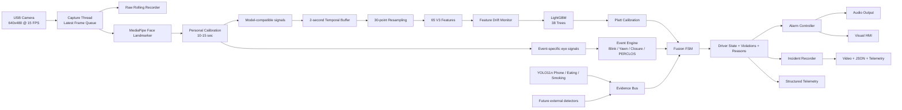
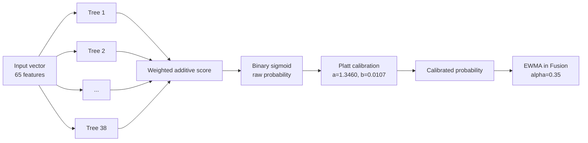
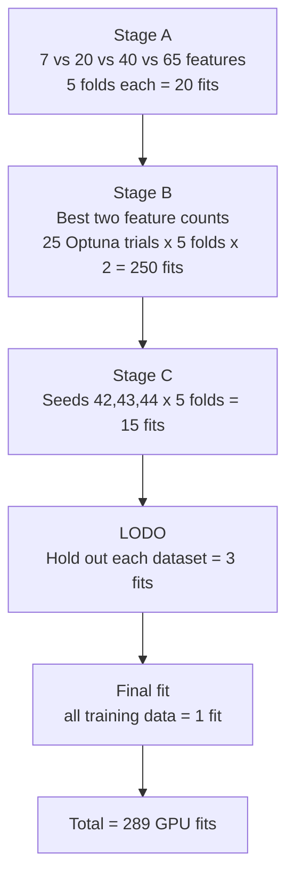
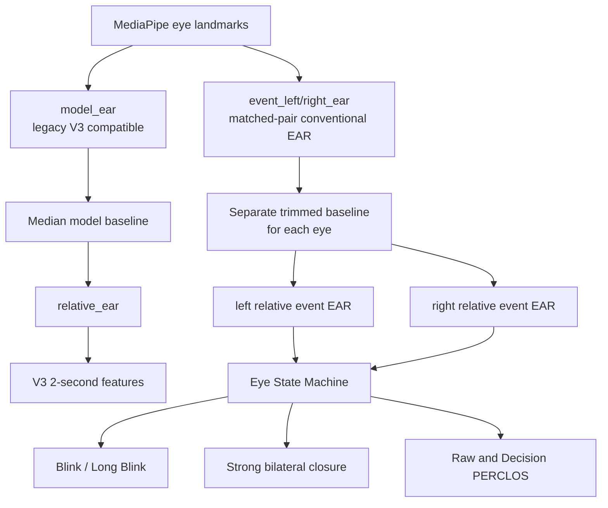
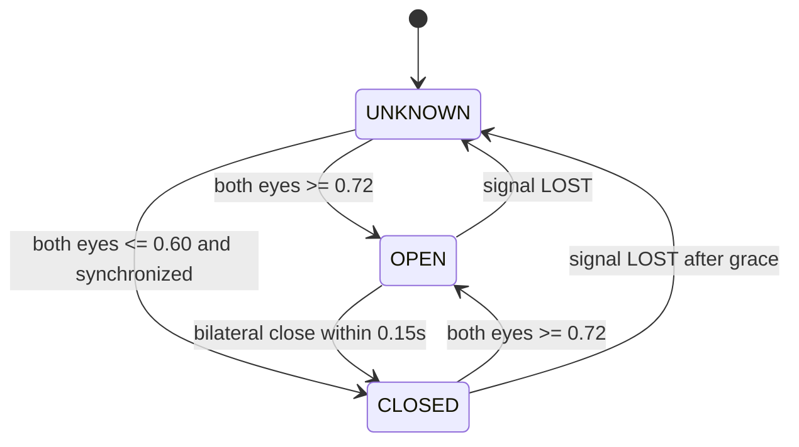
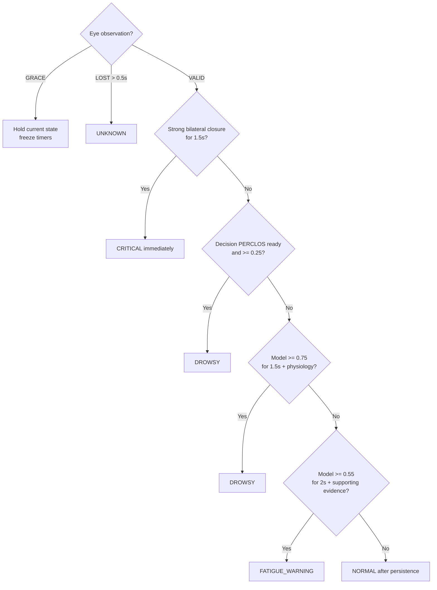
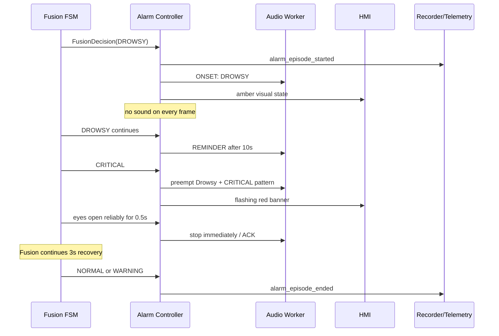
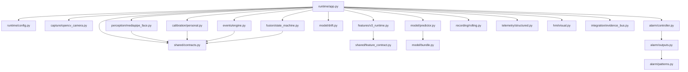

# الدليل الكامل للموديل والـFusion ونظام القرار والإنذار

> **النظام:** Driver Monitoring System (DMS)  
> **نسخة العقود:** `2.4.0`  
> **نسخة الـFusion:** `fusion-2.4.0`  
> **نسخة Eye Events:** `eye-events-v2.4`  
> **الموديل الحالي:** `20260731T140605Z_full_runtimefix1`  
> **حالة الموديل:** `EXPERIMENTAL`  
> **وضع التشغيل الحالي:** `SHADOW — LOCAL AUDIO DEMO`

هذه الوثيقة تشرح النظام من أول فريم تلتقطه الكاميرا حتى تحديد حالة السائق، إطلاق الإنذار، وتسجيل الحادثة. وهي مكتوبة لتكون مرجعًا تقنيًا يمكن استخدامه في المناقشة الأكاديمية أو العرض أمام المشرف.

---

## 1. ما المشكلة التي يحلها النظام؟

الهدف ليس بناء مصنف يقول فقط `نعسان/صاحٍ` لكل فريم. الهدف هو بناء **نظام مراقبة سائق زمني وقابل للتفسير** يجمع بين:

1. إشارات الوجه والعين والفم واتجاه الرأس المستخرجة من الكاميرا.
2. موديل تعلم آلي يعطي **احتمال خطر النعاس** من نافذة زمنية.
3. كاشف أحداث فسيولوجية مستقل: رمش، إغلاق طويل، تثاؤب، حركة رأس، وPERCLOS.
4. طبقة Fusion تدمج الاحتمال والأحداث وجودة القياس والذاكرة الزمنية.
5. Alarm Controller يحول الحالة المستمرة إلى أوامر صوتية محدودة، بدل إصدار صوت مع كل فريم.
6. تسجيل فيديو وTelemetry لكل حادثة حتى يمكن تفسير القرار ومراجعته.

المبدأ الأساسي هو:

> **الموديل مصدر دليل واحد، وليس صاحب القرار النهائي.**

سبب ذلك أن بيانات التدريب موسومة على مستوى الفيديو، لا على مستوى كل لحظة أو نافذة. لذلك يمكن أن يرث جزء طبيعي من فيديو نعسان الوسم الإيجابي، والعكس صحيح. الـFusion يقلل أثر هذا الضعف باستخدام أحداث فسيولوجية وقيود زمنية قابلة للتفسير.

---

## 2. المعمارية العامة



### لماذا فصلنا المكونات؟

- تغيير طريقة الرمش لا يغير ميزات الموديل المدرب.
- تغيير سياسة الإنذار لا يحتاج إعادة تدريب.
- Detector الهاتف والأكل والتدخين ينشر `EvidenceEvent` دون تعديل LightGBM، ويمكن إضافة Detectors أخرى بالطريقة نفسها.
- يمكن اختبار كل مرحلة منفردة باستخدام Fake data أو Replay.
- كل قرار يحمل `reason_codes`، لذلك نستطيع معرفة لماذا وصل النظام إلى الحالة.

---

## 3. كيف تم تجهيز بيانات الموديل؟

### 3.1 البيانات الأصلية

كل سطر في البيانات الخام يمثل فريمًا له timestamp، ويحمل قياسات مثل EAR وMAR وHead Pose وGaze. هذه بيانات متسلسلة زمنيًا داخل كل فيديو.

### 3.2 النافذة الزمنية

تم تحويل السلسلة إلى نوافذ:

- طول النافذة: `2.0s`.
- معدل التشغيل المستهدف: `15 FPS`.
- عدد النقاط الموحد داخل النافذة: `30` نقطة.
- خطوة التحديث في التشغيل: `0.5s`.
- الحد الأدنى للتغطية: `80%`.

إذا كان الـFPS الحقيقي غير ثابت، لا يعتمد النظام على رقم الفريم. يستخدم `monotonic timestamp`، ثم يعيد أخذ العينات على شبكة من 30 نقطة:

```text
t0, t1, ... frames with irregular timestamps
                 ↓ interpolation by time
0.000, 0.067, 0.133, ... approximately 30 points over 2 seconds
```

هذا يعني أن كاميرا 15 أو 30 أو 60 FPS تمثل نفس **المدة الفيزيائية**. عدد الفريمات الأصلي قد يختلف، لكن المدخل النهائي موحد زمنيًا.

### 3.3 هل الموديل يستقبل مصفوفة `30 × 13`؟

لا. هذا كان ممكنًا لو استخدمنا LSTM/GRU، لكن الموديل النهائي LightGBM.

المسار هو:

```text
13 base temporal signals
        ↓
2-second window resampled to 30 points
        ↓
statistical and temporal feature extraction
        ↓
65-number vector
        ↓
LightGBM
```

إذًا:

- **قبل هندسة الميزات:** لدينا عدة قنوات زمنية، كل واحدة فيها 30 نقطة.
- **عند مدخل LightGBM:** لدينا متجه واحد شكله `(65,)`.
- LightGBM لا يرى ترتيب النقاط مباشرة، بل يرى ملخصات تحافظ على معلومات التوزع والحركة داخل النافذة.

---

## 4. القنوات الأساسية الداخلة في بناء ميزات الموديل

الـFeature Schema يسجل **13 إشارة أساسية**. كلمة Channel هنا تعني سلسلة قياس عبر الزمن، وليست Channel صورة RGB.

| # | الإشارة | معناها | الوحدة/النطاق التقريبي |
|---:|---|---|---|
| 1 | `ear` | متوسط نسبة فتحة العينين في المسار المتوافق مع بيانات V3 | نسبة هندسية |
| 2 | `left_ear` | فتحة العين اليسرى | نسبة هندسية |
| 3 | `right_ear` | فتحة العين اليمنى | نسبة هندسية |
| 4 | `relative_ear` | `ear / personal model EAR baseline` | نسبة شخصية بلا وحدة |
| 5 | `mar` | Mouth Aspect Ratio، مقدار فتح الفم | نسبة هندسية |
| 6 | `pitch` | ميل الرأس للأعلى/الأسفل | درجة |
| 7 | `yaw` | التفات الرأس يمينًا/يسارًا | درجة |
| 8 | `roll` | ميل الرأس الجانبي | درجة |
| 9 | `gaze_x` | موضع القزحية أفقيًا داخل العين | قيمة مطبّعة تقريبًا `[-1,1]` |
| 10 | `gaze_y` | موضع القزحية رأسيًا داخل العين | قيمة مطبّعة تقريبًا `[-1,1]` |
| 11 | `gaze_zone` | `CENTER/LEFT/RIGHT/UP/DOWN/UNKNOWN` | فئة categorical |
| 12 | `face_velocity_x` | سرعة حركة مركز الوجه أفقيًا | عرض وجه/ثانية |
| 13 | `head_motion` | مقدار تغير زوايا الرأس مع الزمن | درجة/ثانية |

ملاحظة مهمة: Runtime يحسب إشارات إضافية للأحداث مثل `event_left_relative_ear` و`decision_perclos`، لكنها **لا تدخل إلى الموديل الحالي**. تدخل إلى Event Engine والـFusion فقط. هذا الفصل يحمي عقد الموديل من التغيير.

---

## 5. الميزات الـ65 الداخلة فعليًا إلى LightGBM

الترتيب مهم جدًا؛ `feature_schema.json` هو العقد الرسمي. يقارن Runtime الترتيب قبل كل Prediction ويرفض أي متجه غير مطابق.

### 5.1 ميزات العين — 24 ميزة

| المصدر | الميزات |
|---|---|
| EAR العام | `ear_q25`, `ear_energy`, `ear_max`, `ear_q75`, `ear_min`, `ear_mean` |
| العين اليمنى | `right_ear_q75`, `right_ear_energy`, `right_ear_max`, `right_ear_q25`, `right_ear_mean` |
| العين اليسرى | `left_ear_mean`, `left_ear_min`, `left_ear_q25`, `left_ear_energy`, `left_ear_q75`, `left_ear_max`, `left_ear_coefficient_of_variation` |
| EAR النسبي | `relative_ear_min`, `relative_ear_std`, `relative_ear_q25`, `relative_ear_q75`, `relative_ear_max`, `relative_ear_mean` |

### 5.2 وضعية الرأس — 16 ميزة

| المصدر | الميزات |
|---|---|
| Yaw | `yaw_q25`, `yaw_min`, `yaw_max`, `yaw_energy`, `yaw_coefficient_of_variation` |
| Pitch | `pitch_min`, `pitch_q25`, `pitch_mean`, `pitch_max`, `pitch_q75`, `pitch_energy` |
| Roll | `roll_min`, `roll_energy`, `roll_q75`, `roll_q25`, `roll_max` |

### 5.3 اتجاه النظر — 14 ميزة

| المصدر | الميزات |
|---|---|
| Gaze X | `gaze_x_min`, `gaze_x_max`, `gaze_x_energy` |
| Gaze Y | `gaze_y_max`, `gaze_y_energy`, `gaze_y_mean_absolute_change`, `gaze_y_maximum_absolute_change`, `gaze_y_range`, `gaze_y_skewness`, `gaze_y_q75`, `gaze_y_variance`, `gaze_y_median`, `gaze_y_q25` |
| Gaze Zone | `gaze_zone_DOWN_ratio` |

### 5.4 الفم — 6 ميزات

`mar_max`, `mar_energy`, `mar_min`, `mar_q25`, `mar_mean`, `mar_variance`.

### 5.5 الحركة — 5 ميزات

- حركة الوجه: `face_velocity_x_max`, `face_velocity_x_min`, `face_velocity_x_maximum_absolute_change`.
- حركة الرأس: `head_motion_q25`, `head_motion_median`.

المجموع:

```text
Eyes 24 + Head Pose 16 + Gaze 14 + Mouth 6 + Motion 5 = 65 features
```

### 5.6 معنى أشهر الإحصاءات

| اللاحقة | المعنى |
|---|---|
| `_mean` | المتوسط خلال ثانيتين |
| `_min`, `_max` | أصغر وأكبر قيمة |
| `_q25`, `_q75` | الربع الأول والثالث؛ أقل تأثرًا بالقيم الشاذة من min/max |
| `_variance`, `_std` | مقدار تذبذب الإشارة |
| `_energy` | متوسط مربع القيم `mean(x²)` |
| `_range` | `max - min` |
| `_coefficient_of_variation` | الانحراف المعياري مقسومًا على مقدار المتوسط |
| `_skewness` | عدم تماثل توزيع القيم |
| `_mean_absolute_change` | متوسط مقدار التغير بين نقطتين متتاليتين |
| `_maximum_absolute_change` | أكبر قفزة زمنية داخل النافذة |
| `_ratio` | نسبة زمن/نقاط ظهور الفئة داخل النافذة |

لا يستخدم LightGBM `StandardScaler`؛ الأشجار لا تحتاج توحيد المقاييس مثل الشبكات العصبية.

---

## 6. هيكلية الموديل: هل لديه طبقات؟

### الجواب المختصر الذي يقال للدكتور

> الموديل النهائي Binary LightGBM Gradient-Boosted Decision Trees، وليس Neural Network. لذلك لا يملك LSTM layers أو Dense layers. يتكون من 38 شجرة متتابعة، أقصى عمق مضبوط على 7، وحتى 26 ورقة للشجرة، وتدخل إليه 65 ميزة رقمية مرتبة. تجمع مساهمات الأشجار في Logit، ثم تحول إلى Probability، وبعدها نطبق Platt Calibration قبل إرسال الاحتمال إلى Fusion.

### 6.1 البنية الفعلية



### 6.2 أرقام الموديل

| الخاصية | القيمة |
|---|---:|
| النوع | `LightGBM binary classifier` |
| عدد الأشجار | `38` |
| `num_leaves` | `26` |
| `max_depth` | `7` |
| `learning_rate` | `0.032956` |
| `min_child_samples` | `48` |
| `subsample` | `0.885837` |
| `colsample_bytree` | `0.750401` |
| `reg_alpha` | `0.003987` |
| `reg_lambda` | `0.729561` |
| عدد المدخلات | `65` |
| عدد المخرجات | احتمال واحد بين 0 و1 |

### 6.3 ما المقصود بالـBoosting؟

الشجرة الأولى تتعلم جزءًا من العلاقة. كل شجرة بعدها تحاول تحسين الأخطاء المتبقية من الأشجار السابقة. المخرج ليس تصويت Majority بسيط، بل مجموع مساهمات صغيرة متتابعة:

```text
score(x) = bias + learning_rate × Σ tree_k(x)
raw_probability = sigmoid(score(x))
```

### 6.4 المعايرة الاحتمالية Platt Calibration

احتمال الشجرة الخام ليس مضمونًا أن يكون احتمالًا معايرًا. لذلك طبقنا:

```text
logit(p_raw) = ln(p_raw / (1 - p_raw))
z = 1.3460435723 × logit(p_raw) + 0.0106974132
p_calibrated = sigmoid(z)
```

تم تدريب المعايرة من **OOF training predictions فقط**؛ لم نستخدم test لضبطها.

الـOperating threshold المحفوظ هو `0.317`. هذا الحد يسجل هل الموديل إيجابي وفق تجربة التدريب، لكنه **لا يطلق إنذارًا مباشرة**. حالات Fusion تستخدم حدودًا وسياسات أقوى.

### 6.5 لماذا لم نحفظه TFLite؟

TFLite مخصص أساسًا لشبكات TensorFlow. LightGBM يُحفظ بصيغته الأصلية `model.txt` ويقرأه LightGBM Booster مباشرة. هذه الصيغة:

- خفيفة ومناسبة للـRaspberry Pi CPU.
- لا تحتاج TensorFlow Runtime.
- تحفظ بنية الأشجار بدقة.
- تُحمى بـchecksums وGolden Samples للتحقق من تطابق النتائج.

---

## 7. كيف تم تدريب واختيار الموديل؟

### 7.1 البيانات والفصل العلمي

- Train fitting: `70,771` نافذة.
- Fixed test: `15,791` نافذة.
- SAFEE المستبعدة من fitting: `98` نافذة train.
- SAFEE positive stress test: `53` نافذة.
- تقسيم Grouped حسب `dataset::subject`.
- عند غياب subject يُستخدم `video_id` كـfallback.
- لا يوجد overlap بين train وtest groups.
- الأوزان توازن dataset ثم class ثم subject/video حتى لا تسيطر داتا كبيرة على التدريب.

### 7.2 مراحل التجربة



- **Stage A:** مقارنة أحجام feature sets بإعداد محافظ مشترك.
- **Stage B:** تحسين Hyperparameters لأفضل قائمتين.
- **Stage C:** فحص ثبات الاختيار عبر ثلاثة Seeds وإنتاج OOF predictions.
- **LODO:** تدريب دون Dataset كاملة ثم اختبار عليها لمعرفة Domain Generalization.
- **Final:** تدريب النموذج النهائي على كامل train بعد تثبيت كل الخيارات.

### 7.3 ما هو Seed؟

الـSeed يثبت العشوائية في تقسيم المجموعات، sampling، وعمليات LightGBM. تشغيل Seeds مختلفة يختبر هل النتيجة مستقرة أم ناجحة بسبب تقسيم محظوظ. استخدمنا `42, 43, 44`.

### 7.4 النتائج العلمية للمصنف وحده

| التقييم | Precision | Recall | F1 | FPR | PR-AUC | ROC-AUC |
|---|---:|---:|---:|---:|---:|---:|
| OOF Train | 0.549 | 0.911 | 0.685 | 0.743 | 0.708 | 0.696 |
| Fixed Test | 0.516 | 0.874 | 0.649 | 0.762 | 0.675 | 0.654 |

النتيجة تحقق Recall قريبًا من الهدف لكنها تعاني False Positives مرتفعة. لذلك الـBundle مصنف `EXPERIMENTAL` ولم نستخدم الموديل منفردًا كمنظومة أمان.

سبب علمي مهم: الوسم الأصلي Video-level weak label. إذا كان الفيديو موسومًا Drowsy، كل نوافذه ترث الوسم، حتى النوافذ التي يبدو فيها السائق طبيعيًا. لذلك قياسات Window classifier لا تساوي حقيقة سريرية لحظة بلحظة.

### 7.5 Model Bundle

| الملف | دوره |
|---|---|
| `model.txt` | الأشجار الـ38 بصيغة LightGBM الأصلية |
| `calibration.json` | معاملات Platt calibration |
| `operating_point.json` | Threshold التجربة `0.317` |
| `feature_schema.json` | أسماء وترتيب الـ65 ميزة وصيغة النافذة |
| `feature_reference.json` | حدود q01/q99 وأهمية الميزات لمراقبة Domain Shift |
| `training_manifest.json` | الداتا، hashes، الإعدادات، Seeds، وعدد التدريبات |
| `golden_samples.json` | مدخلات ومخرجات مرجعية لفحص التطابق |
| `checksums.sha256` | كشف أي تعديل أو تلف في الملفات |
| `MODEL_CARD.md` | الاستخدام المقصود والقيود العلمية |

عند Startup:

1. تُفحص كل الملفات والـchecksums.
2. يُفحص إصدار Feature Contract.
3. يُمنع Bundle تجريبي من العمل بوضع `ACTIVE`.
4. تُشغّل Golden Samples.
5. أقصى فرق حالي في calibrated probability هو `1.11e-16`، أقل من tolerance `1e-6`.

---

## 8. مسارا العين المنفصلان



### لماذا يوجد EAR للموديل وEAR للأحداث؟

- `model_ear` يحافظ على التطابق مع Feature Engineering V3 التي تدرب عليها LightGBM.
- `event_ear` يستخدم أزواج نقاط جفن متناظرة لكل عين، وهو أنسب لعد الرمش والإغلاق.
- تعديل `model_ear` بعد التدريب قد يسبب Distribution Shift ويغير احتمالات الموديل.
- لذلك أصلحنا الرمش والـCritical في مسار مستقل دون كسر Golden Samples.

---

## 9. المعايرة الشخصية

تعمل أول `10s`، ويمكن أن تمتد حتى `15s`.

### شروط قبول الفريم

- الوجه موجود.
- `face_quality ≥ 0.55`.
- `eye_signal_valid = true`.
- أقصى `|pitch|, |yaw|, |roll| ≤ 25°`.
- قيم العين موجبة وصالحة.
- عرض الوجه لا يقل عن `20%` من عرض الصورة.
- المسافة بين مركزي العينين لا تقل عن `50px`، وعرض كل عين لا يقل عن `24px` عند `640×480`.
- نحتاج `75` فريمًا جيدًا على الأقل.

### القيم الناتجة

- Median لـ`model_ear`.
- Baseline منفصل للعين اليسرى واليمنى في Event path.
- MAR baseline.
- Pitch/Yaw/Roll baselines.
- Gaze-Y baseline.
- CV واستقرار EAR وتماثل العينين وعدد الفريمات المستبعدة.

يستبعد Event baseline أدنى `20%` وأعلى `5%` من قيم العين لتخفيف تأثير الرمش والقيم الشاذة. إذا فشلت المعايرة لا نفترض أن السائق طبيعي؛ تبقى الحالة `UNKNOWN`.

---

## 10. Event Engine بالتفصيل

Event Engine يعمل كل فريم ويستخدم الزمن الفعلي، وليس عدد الفريمات.

### 10.1 جودة إشارة العين

| الحالة | المعنى | سلوك النظام |
|---|---|---|
| `VALID` | قياس العين موثوق الآن | تحديث FSM وPERCLOS |
| `GRACE` | فجوة قصيرة حتى `0.30s` | تثبيت الحالة وعدم اختراع إغلاق جديد |
| `LOST` | الفجوة تجاوزت المهلة | إلغاء الإغلاق الجاري وعدم توليد Blink كاذب |

Fusion ينتقل إلى `UNKNOWN` فقط إذا استمر الفقد `0.50s`. فجوة قصيرة بسبب MediaPipe لا تسبب تذبذبًا مباشرًا.

إذا فشل شرط دقة العين بالبكسل تصبح الحالة `DRIVER_TOO_FAR` وتعرض الشاشة `MOVE CLOSER / ADJUST CAMERA`. لا يسمح النظام بإعلان `NORMAL` عندما تكون العين أصغر من الدقة القابلة للقياس. تسجل telemetry: `face_width_ratio`, `interocular_distance_px`, `left_eye_width_px`, `right_eye_width_px` و`eye_resolution_valid`.

### 10.2 Eye State Machine



- إغلاق يبدأ عند Relative Event EAR `≤0.60`.
- إعادة الفتح عند `≥0.72`.
- الفرق بين الحدين هو Hysteresis لمنع التذبذب.
- يجب أن تغلق العينان خلال `0.15s`.
- إغلاق عين واحدة لا يصبح Blink أو Critical.
- Blink المقبول يبدأ من `0.05s` وحتى `0.80s`.
- ما فوق `0.80s` يسمى `LONG_BLINK`.

### 10.3 Strong Bilateral Closure

لا يكفي أن تكون Eye FSM في CLOSED لمدة `1.5s`. لإنتاج `PROLONGED_EYE_CLOSURE` ثم `CRITICAL` يجب خلال آخر `1.5s` تحقيق:

1. تغطية قياس صالحة `≥80%`.
2. Median لأكبر EAR نسبي بين العينين `≤0.30`.
3. `≥80%` من العينات لها أكبر EAR `≤0.40`.
4. العينان مغلقتان، وليس عينًا واحدة.
5. نسبة العينات التي تشبه Downward Gaze أقل من `50%`.

استخدام `max(left EAR, right EAR)` متعمد: حتى يعتبر الإغلاق قويًا يجب أن تكون **كلتا العينين** منخفضتين.

عندما يكون الجفنان منخفضين بقوة (`max-eye EAR ≤0.40`) لا تستخدم إحداثيات iris لإلغاء الإغلاق؛ لأن القزحية لا يمكن تحديدها بثقة خلف جفن مغلق. في هذه الحالة يعتمد القرار على هندسة الجفنين الثنائية وتماثلهما وPose وجودة الدقة. أما عندما تكون العين مفتوحة أو جزئيًا مفتوحة، يبقى شرط Gaze فعالًا لمنع تحويل النظر للأسفل إلى إغلاق.

### 10.4 Downward Gaze

- تحسب القزحية بالنسبة للجفن، ثم تقارن `gaze_y` مع baseline الشخصي.
- إذا ظهرت حركة للأسفل والقزحية لا تزال مرئية، يُمنع اعتبارها إغلاقًا قويًا.
- بعد استمرارها `0.30s` يمكن تسجيل `DISTRACTION` subtype `DOWNWARD_GAZE`.

هذا هو الإصلاح الذي يمنع النظرة للأسفل من التحول خطأً إلى Critical.

### 10.5 التثاؤب

```text
mouth_open = MAR >= max(0.15, personal_MAR_baseline × 1.55)
```

إذا استمر فتح الفم بين `1.2s` و`8s` ثم أغلق، يصدر Event من نوع `YAWNING`.

- التثاؤب يسجل كمخالفة وIncident.
- التثاؤب وحده لا يثبت Drowsy.
- تثاؤبان في 60 ثانية ينتجان `REPEATED_YAWNS`، لكنهما يبقيان دليلًا مساعدًا فقط.

### 10.6 Head Nod

إذا زاد Pitch عن baseline بمقدار `18°` لمدة `0.35s` يصدر `HEAD_NOD` بدقة/ثقة `0.9` وTTL أربع ثوانٍ.

### 10.7 PERCLOS

PERCLOS هو نسبة زمن إغلاق العين إلى زمن المراقبة الصالح:

```text
PERCLOS = closed_observation_time / valid_observation_time
```

لدينا نوعان:

- `raw_perclos_30s`: سجل تشخيصي يحتفظ بتاريخ الإغلاق.
- `decision_perclos_30s`: ذاكرة قرار قابلة للاستهلاك.

بعد فتح موثوق لمدة `0.5s` عقب Risk episode، تمسح فترات الإغلاق القديمة من Decision PERCLOS. الهدف هو منع الإغلاق السابق من إعادة Drowsy بعد أن فتح السائق عينيه واستجاب.

لا يستخدم Fusion PERCLOS حتى تتوفر:

- مراقبة صالحة `≥20s`.
- Coverage `≥0.67`.
- دخول Drowsy عند `≥0.25`.
- خروج عند `≤0.18`، أي Hysteresis.

---

## 11. مراقبة Domain Shift

يحتوي الـBundle على مرجع توزيعات `q01/q99` لأهم الميزات بحسب Gain.

لكل نافذة:

1. يفحص `FeatureDriftMonitor` أهم 20 ميزة.
2. يحسب عدد الميزات خارج `[q01, q99]`.
3. إذا خرج أكثر من `30%` لثلاث نوافذ متتالية، يسجل `MODEL_INPUT_OOD`.
4. يعطل **مساهمة LightGBM فقط** مؤقتًا.
5. تبقى Events، PERCLOS، وStrong Closure فعالة.
6. بعد ثلاث نوافذ جيدة متتالية يعاد السماح للموديل.

هذه آلية Fail-safe: بيانات كاميرا مختلفة لا تتحول تلقائيًا إلى قرار نعاس من موديل خارج مجاله.

---

## 12. ما هو الـFusion؟

الـFusion هو **Finite State Machine زمني وقابل للتفسير**. يستقبل:

- Calibrated model probability.
- EWMA الاحتمال.
- Blink/Long Blink/Yawn/Head Nod/Closure events.
- Raw وDecision PERCLOS.
- جودة العين `VALID/GRACE/LOST`.
- حالة Drift وهل مساهمة الموديل مفعلة.
- مستقبلًا: Phone/Smoking/Eating/Distraction عبر Evidence Bus.

ويخرج عقدًا اسمه `FusionDecision` يحتوي:

- الحالة السابقة والحالية والهدف المرشح.
- المخالفات.
- مستوى الإنذار المنطقي.
- `reason_codes`.
- الاحتمال المملّس.
- عمر الحالة والمرشح.
- صلاحية دليل العين.
- Recovery status.
- هل Risk الموديل ما زال Pending دون دليل فسيولوجي.

### 12.1 لماذا نستخدم EWMA؟

بدل اتخاذ قرار من Prediction واحدة:

```text
p_smooth(t) = 0.35 × p_new + 0.65 × p_smooth(t-1)
```

هذا يقلل القفزات السريعة. النموذج يعمل كل `0.5s`، بينما Event Engine يعمل كل فريم.

### 12.2 الحالات

| الحالة | معناها |
|---|---|
| `UNKNOWN` | لا توجد معايرة أو إشارة موثوقة كافية |
| `NORMAL` | لا يوجد دليل خطر مؤكد |
| `FATIGUE_WARNING` | خطر متوسط أو دليل مساعد غير كافٍ لإثبات النعاس |
| `DROWSY` | خطر نعاس مدعوم زمنيًا وفسيولوجيًا، أو PERCLOS موثوق |
| `CRITICAL` | إغلاق عينين قوي وموثوق مستمر `≥1.5s` |

### 12.3 منطق تحديد Target State



### 12.4 شروط الحالات بالتفصيل

#### `CRITICAL`

- مصدره الوحيد حاليًا Strong Bilateral Closure.
- لا يحتاج انتظار Prediction جديدة.
- لا يصدر من احتمال LightGBM ولو كان `0.99`.
- إذا فقدت الإشارة أثناء Critical تبقى Critical مع `CRITICAL_EYE_SIGNAL_LOST`؛ لا نتذبذب إلى Unknown.
- الخروج يحتاج فتح عين موثوق مستمر `3s`.

#### `DROWSY`

أحد المسارات:

1. Decision PERCLOS موثوق `≥0.25`.
2. EWMA model probability `≥0.75` مستمرة `1.5s` **مع دليل فسيولوجي** مثل:
   - Trustworthy Long Blink.
   - Head Nod.
   - Sustained Partial Closure.
3. احتمال `≥0.75` مع إغلاق ثنائي قوي حالي مستمر `0.5s`: يدخل Drowsy مباشرة، وإذا أكمل الإغلاق `1.5s` يتصاعد إلى Critical. مدة الإغلاق نفسها هي Persistence لهذا المسار، لذلك لا نضيف انتظارًا ثانيًا فوقها.

التثاؤب النشط يمنع استخدام إشارة إغلاق الفم/العين المختلطة لتصعيد Drowsy خطأً.

#### `FATIGUE_WARNING`

- Model probability `≥0.55` لمدة `2s` مع دليل مساعد.
- أو مرحلة تعافٍ بعد Critical عند بقاء ذاكرة PERCLOS.
- Warning يظهر بصريًا ويسجل، لكنه لا يصدر صوتًا في السياسة الحالية.

#### `NORMAL`

- Risk تحت حدود الخروج.
- يحتاج `3s` Persistence في بداية التشغيل أو عند هبوط الحالة.
- بعد فقد جودة مؤقت والعودة، يحتاج `1s` موثوقة بدل إعادة المعايرة كاملة.

#### `UNKNOWN`

- قبل نجاح المعايرة.
- فقد عين/وجه مستمر أكثر من `0.5s` خارج Critical.
- دقة العين بالبكسل أقل من الحدود الآمنة: `DRIVER_TOO_FAR` بدل إعلان Normal كاذب.
- لا يعني نعاسًا ولا يعني طبيعيًا؛ يعني **لا يمكن اتخاذ قياس موثوق**.

### 12.5 Persistence وHysteresis وCooldown

- **Persistence:** الشرط يجب أن يستمر مدة قبل الانتقال.
- **Hysteresis:** حد الدخول أعلى من حد الخروج، مثل Warning `0.55/0.42` وDrowsy `0.75/0.58`.
- **Cooldown:** يمنع انتقالات متقاربة أسرع من ثانية.
- **TTL:** الأدلة القديمة تنتهي، افتراضيًا خلال خمس ثوانٍ بحسب نوع الحدث.

هذه الآليات تمنع Flickering بين الحالات.

### 12.6 الفرق بين Driver State وViolation

هذا فصل أساسي:

```text
Driver State: مستوى وعي/تعب السائق
Violation: حدث أو مخالفة مستقلة قد تحتاج تسجيلًا
```

مثال:

```text
driver_state = NORMAL
violations = [YAWNING]
alarm_level = WARNING
```

هنا نسجل Incident للتثاؤب، لكن لا نقول إن السائق Drowsy ولا نشغل صوت نعاس.

المخالفات المدعومة حاليًا، مع قابلية إضافة غيرها:

`YAWNING`, `REPEATED_YAWNS`, `EXCESSIVE_BLINKING`, `PROLONGED_EYE_CLOSURE`, `DISTRACTION`, `PHONE_USE`, `SMOKING`, `EATING`.

---

## 13. من Fusion إلى الإنذار

الـFusion يحدد الحالة مع كل دورة، لكنه لا يتحكم مباشرة بالسماعة. `AlarmController` ينشئ Alarm Episodes ويعتمد على الحواف الزمنية:



### 13.1 سياسة الصوت

| الحالة | صوت البداية | التذكير | الاستجابة |
|---|---|---|---|
| `FATIGUE_WARNING` | لا صوت | لا صوت | HMI وLogs فقط |
| `DROWSY` | `750Hz` لمدة `0.45s` | بعد `10s` ثم كل `10s` | فتح موثوق `0.5s` يصمت `10s` |
| `DROWSY_ESCALATED` | 3 نبضات، كل منها `900Hz/0.30s` وبينها `0.15s` | كل `7s` | عند 3 episodes/60s أو استمرار 30s |
| `CRITICAL` | `1100Hz/0.70s` ثم فجوة `0.20s` ثم `1400Hz/0.70s` | كل `4s`، ثم `2.5s` بعد استمرار 15s | فتح موثوق `0.5s` يوقف الصوت فورًا |
| Yawn/Unknown | لا صوت | لا صوت | Visual/Incident/Logging فقط |

### 13.2 لماذا لا يصدر صوت كل فريم؟

كل حالة تنشئ `episode_id`. يصدر Onset مرة عند البداية، ثم Reminders وفق Clock monotonic. إذا خرجت Drowsy وعادت خلال أقل من `5s` تعتبر نفس الحلقة ولا يعاد صوت البداية بسبب التذبذب. إذا عادت بعد `5s` تبدأ حلقة جديدة.

Critical له أولوية أعلى:

- يوقف أي صوت Drowsy قيد التشغيل.
- يلغي الأوامر القديمة الموجودة في Queue.
- يصدر نمطه فورًا.
- لا يسمح بتداخل صوتين.

### 13.3 مخرجات الصوت

- `LinuxAudioOutput`: يولد WAV محليًا PCM mono/44.1kHz، ويستخدم أول Backend متوفر من `aplay`, `paplay`, `pw-play`, `ffplay`.
- `NullAlarmOutput`: للاختبارات وReplay؛ يسجل القرار دون صوت.
- `GPIOBuzzerOutput`: عقد جاهز لكن غير مفعل حتى تحدد دارة الـBuzzer على Raspberry.

الصوت يعمل في Worker مستقل وPriority Queue محدودة، لذلك لا يوقف AI loop.

### 13.4 HMI

- Drowsy: شريط كهرماني ثابت.
- Critical: شريط أحمر يومض `2Hz`.
- يعرض `SHADOW — LOCAL AUDIO DEMO`.
- يعرض `READY/PLAYING/ACKNOWLEDGED/FAILED`.
- يرسم على **نسخة** من الفريم؛ الفيديو الخام المسجل لا يتغير.

---

## 14. تسجيل الحوادث والـTelemetry

### 14.1 Rolling Recorder

الكاميرا تسجل باستمرار إلى Buffer مضغوط. عند Warning أو Critical:

- `10s` قبل الإنذار.
- كامل مدة الإنذار.
- `10s` بعده.
- دمج الحوادث المتقاربة خلال `5s`.
- حد أقصى `60s` لكل Clip.
- FFmpeg/H.264 هو الأساسي، وOpenCV `mp4v` fallback.

كل Incident ينتج:

```text
incidents/outbox/<incident_id>/
├── video.mp4
├── incident.json
└── telemetry.jsonl
```

### 14.2 Structured Telemetry

كل Record يحمل:

```text
utc_timestamp, monotonic_sec, session_id,
frame_id, window_id, incident_id,
stage, event, level, payload
```

المراحل المسجلة تشمل:

- Startup وBundle verification.
- Perception وEAR/MAR/Pose/Gaze والـlatency.
- Calibration وBaselines.
- Events وPERCLOS والرمش والتثاؤب.
- Window coverage والـ65 features في DEBUG.
- Raw وCalibrated model probabilities.
- Drift وحالة مساهمة الموديل.
- Fusion state وtarget وreason codes.
- Alarm onset/reminder/escalation/ack/preemption/failure.
- Recorder وIncident IDs.
- CPU/RAM/Temperature/Queues/Dropped frames.

هذا يسمح بتتبع كامل:

```text
video time → frame_id → FaceSignal → window_id → model probability
→ event evidence → Fusion reason → alarm_id → incident_id
```

---

## 15. التسلسل الكامل لدورة تشغيل واحدة

1. `LatestFrameCapture` يقرأ الفريم في Thread مستقل ويحفظ الأحدث في Queue صغيرة.
2. Recorder يحصل على الفريم الخام دون Overlay.
3. `MediaPipeFacePerception.process()` يحول الفريم إلى `FaceSignal`.
4. `PersonalCalibrator.update()` يجمع أول 10–15 ثانية.
5. بعد READY، `apply()` ينتج القيم الشخصية النسبية.
6. `EventEngine.update()` يحدث حالة العين والفم ويصدر Evidence.
7. `V3RuntimeFeatureBuilder.update()` يضيف الإشارة إلى Buffer.
8. كل `0.5s` يبني نافذة آخر ثانيتين ويعيدها إلى 30 نقطة.
9. يحسب الميزات ويختارها بترتيب `feature_schema.json`.
10. `FeatureDriftMonitor.evaluate()` يحدد هل مدخل الموديل داخل المجال.
11. `LightGBMRuntimePredictor.predict()` ينتج Raw ثم Calibrated probability.
12. `FusionStateMachine.update()` يدمج الاحتمال والأحداث والجودة والذاكرة الزمنية.
13. Recorder ينشئ/يمدد Incident إذا كان Alarm Level Warning أو Critical.
14. `AlarmController.update()` يقرر Onset/Reminder/Escalation/ACK.
15. `VisualHMI.push()` يعرض الحالة على نسخة من الفريم.
16. Telemetry يسجل جميع المراحل وأزمنة التنفيذ.

---

## 16. مثال عملي لقرار قابل للتفسير

### مثال 1: الموديل مرتفع والعين مفتوحة

```text
calibrated_probability = 0.91
eye_state = OPEN
PERCLOS not high
no trustworthy long blink/head nod/partial closure
```

النتيجة:

```text
driver_state = NORMAL أو الحالة السابقة حسب persistence
model_risk_pending = true
reason = MODEL_RISK_PENDING
audio = none
```

أي إن احتمال الموديل لا يكفي منفردًا.

### مثال 2: تثاؤب واحد

```text
Evidence = YAWNING
```

النتيجة:

```text
violations = [YAWNING]
incident = recorded
visual warning = shown
drowsy audio = none
```

### مثال 3: إغلاق جزئي مستمر مع Model Risk

```text
EWMA probability >= 0.75 for 1.5s
sustained_partial_closure = true
```

النتيجة: `DROWSY`، صوت البداية مرة واحدة، ثم Reminder بعد 10 ثوانٍ إذا استمرت.

### مثال 4: إغلاق كامل موثوق

```text
bilateral closure >= 1.5s
coverage >= 0.80
median max-eye EAR <= 0.30
80% samples <= 0.40
not downward gaze
```

النتيجة: `CRITICAL` فورًا مع نبضتين مميزتين. عند فتح العين موثوقًا `0.5s` يصمت الصوت، بينما Fusion تنتظر `3s` لتأكيد التعافي.

---

## 17. النتائج الحالية وحدود الادعاء

### Offline Model

- Test Precision: `51.6%`.
- Test Recall: `87.4%`.
- Test F1: `64.9%`.
- Test PR-AUC: `67.5%`.
- FPR مرتفعة لأن الموديل وحده متأثر بالـweak labels والـdomain shift.

### Runtime Replay بعد الإصلاحات

على جلسة `raspberry-live-8dce40a9` وبناء Ground Truth تقريبي من توصيف الفيديو:

- Precision تقريبي: `81.6%`.
- Recall زمني تقريبي: `79.3%`.
- F1 تقريبي: `80.4%`.
- FPR تقريبي: `4.9%`.
- Episode detection: `3/3`.
- Median onset delay: قرابة `3s`.
- لم تعد النظرات للأسفل تنتج Critical كاذب في الجزء الذي عولج.
- التثاؤبان اكتُشفا دون Drowsy sound.
- PERCLOS القديم لم يعد يعيد النعاس بعد الاستجابة.

الخلاصة الصادقة:

> النظام تحسن كثيرًا عمليًا، لكنه حاليًا `READY_FOR_CONTROLLED_DEMO` فقط. لم يحقق بعد Recall زمني `≥90%` ولا Median delay `≤2s` على Acceptance موسوم مستقل، ولا يجوز وصفه Production أو نظام DDAW قانوني معتمد.

---

## 18. أسئلة متوقعة من الدكتور وإجابات مختصرة

### كم طبقة في الموديل؟

لا توجد Neural layers؛ الموديل LightGBM من 38 شجرة Boosted، أقصى عمق 7 وحتى 26 ورقة للشجرة. بعد الأشجار يوجد Sigmoid ثم Platt calibration كمرحلتين حسابيتين، لا كطبقات Neural Network.

### كم Channel تدخل إلى الموديل؟

لدينا 13 Base temporal signals تُلخص خلال نافذة ثانيتين، لكن المدخل الفعلي إلى LightGBM هو 65 engineered features، أي شكل `(65,)`.

### لماذا 30 نقطة داخل النافذة؟

لأن النافذة ثانيتان والتردد المرجعي 15Hz: `2 × 15 = 30`. إعادة أخذ العينات بالـtimestamp توحد كاميرات ذات FPS مختلف.

### هل فقدنا الزمن بعد Feature Engineering؟

فقدنا التسلسل الخام الكامل عند مدخل LightGBM، لكن احتفظنا بجزء من المعلومات الزمنية عبر slope، absolute changes، energy، min/max، quantiles، والميزات الزمنية. أما Event Engine فيحتفظ بتسلسل زمني صريح لحساب مدة الإغلاق والرمش وPERCLOS.

### لماذا LightGBM بدل LSTM/GRU؟

كان أفضل خيار عملي ضمن الوقت والـRaspberry CPU، سريع وصغير وقابل للتفسير، ويعمل مباشرة على ميزات V3. لكن بسبب ضعف الوسوم لم نعتمد عليه منفردًا، بل داخل Fusion.

### لماذا لا يطلق احتمال 0.99 Critical؟

لأن الموديل Experimental ومتأثر بالـDomain Shift والوسم الضعيف. Critical قرار سلامة قوي، لذلك مصدره الوحيد إغلاق ثنائي موثوق ومدته 1.5 ثانية.

### ما الفرق بين threshold `0.317` وحدود Fusion؟

`0.317` نقطة تشغيل المصنف المختارة من OOF وتظهر في Telemetry. Fusion تستخدم `0.55` Warning و`0.75` Drowsy مع Persistence ودليل فسيولوجي. لا يوجد ربط مباشر بين `positive=true` والإنذار.

### كيف نمنع الإنذار من التكرار كل فريم؟

Alarm Controller ينشئ Episode لها ID وOnset واحد، ثم يعتمد على monotonic timers للتذكير. Critical تقاطع Drowsy، وفتح العين يولد Acknowledgment ويوقف الصوت.

### ماذا يحدث إذا توقف MediaPipe لحظيًا؟

لدينا GRACE لمدة 0.30s، فتثبت الحالة ولا نولد رمشة أو إغلاقًا جديدًا. بعد فقد مستمر ينتقل النظام إلى LOST ثم UNKNOWN خارج Critical.

### كيف نضيف الهاتف أو التدخين؟

الـDetector الجديد ينشر `EvidenceEvent(kind="PHONE_USE", ...)` على `EvidenceBus`. Fusion تجمعه كمخالفة حسب TTL، والـRecorder يسجل Incident. لا نغير موديل النعاس.

### كيف نثبت أن تطبيق Raspberry يعطي نفس نتيجة Colab؟

Checksums تثبت سلامة الملفات، وGolden Samples تمر عبر LightGBM والمعايرة. Tolerance هو `1e-6` والفرق الفعلي الحالي `1.11e-16`.

---

## 19. هيكلية الفولدرات

```text
dms_final_system/
├── training_colab/     تدريب LightGBM وتصدير Bundle
├── shared/             عقود البيانات وFeature contract
├── runtime/            نظام التشغيل الحي وإعادة الفيديو
│   ├── capture/
│   ├── perception/
│   ├── calibration/
│   ├── temporal/
│   ├── features/
│   ├── model/
│   ├── objects/          YOLO phone/eating/smoking
│   ├── events/
│   ├── fusion/
│   ├── alarm/
│   ├── hmi/
│   ├── recording/
│   ├── telemetry/
│   ├── evaluation/
│   └── integration/
├── models/             MediaPipe والموديلات المركبة
├── configs/            إعدادات التشغيل القابلة للإصدار
├── incidents/          Outbox للحوادث
├── logs/               Runtime JSONL logs
├── evaluation_sessions/ جلسات الفيديو والتقييم
├── tests/              اختبارات العقود والسلوك
└── docs/               الأدلة والتقارير
```

---

## 20. شرح ملفات `shared/`

### `shared/contracts.py`

عقود Dataclasses مشتركة بين المكونات:

- `DriverState`: حالات السائق الخمس.
- `AlarmLevel`: NONE/INFO/WARNING/CRITICAL.
- `FramePacket`: الفريم مع `frame_id` وUTC وmonotonic time.
- `FaceSignal`: كل قياسات MediaPipe والمعايرة.
- `TemporalFeatureSnapshot`: نافذة الـ65 ميزة وCoverage.
- `ModelPrediction`: Raw/Calibrated probability والـthreshold.
- `EvidenceEvent`: حدث مع confidence وTTL وsource وdetails.
- `FusionDecision`: الحالة والأسباب والـviolations والـrecovery.
- `AlarmCommand`: أمر صوتي واحد مع episode وtrigger.
- `AlarmStatus`: حالة Backend والـQueue والـacknowledgment.
- `IncidentRecord`: عقد الحادثة المرسلة إلى Outbox/الشركة.

كل `to_dict()` يحول العقد إلى صيغة قابلة للتسجيل في JSON.

### `shared/feature_contract.py`

- يعرف Base signals المسموحة والحدود الفيزيائية.
- يثبت `WINDOW_SEC=2`, `TARGET_SAMPLES=30`, `MIN_COVERAGE=0.8`.
- `base_signal_for_feature()`: يعيد أصل كل Feature.
- `is_deployable_feature()`: يمنع Metadata أو Features غير قابلة للحساب Runtime.
- `audit_features()`: يفحص leakage والميزات غير المدعومة.

---

## 21. شرح ملفات `training_colab/`

### الملفات العليا

- `DMS_LIGHTGBM_COLAB.ipynb`: Notebook بنظام Run All؛ يربط Drive، يثبت المتطلبات، يشغل Smoke/Full، ويصدر ZIP.
- `requirements.txt`: إصدارات مكتبات التدريب.
- `README_AR.md`: دليل Colab.

### `dms_training/config.py`

- `ExperimentConfig`: مسارات Train/Test/Feature decisions، Seeds، Feature counts، folds، Optuna وGPU.
- `validate()`: يتحقق من القيم والمسارات.
- `to_dict()`: يحفظ الإعدادات في Manifest.

### `dms_training/data.py`

- `validate_schema()`: يفحص أعمدة Train/Test.
- `canonical_subject_id()`: يوحد `001`, `1`, `1.0`.
- `canonical_group()`: يبني `dataset::subject` أو video fallback.
- `prepare_frame()`: يحول labels/features ويفحص leakage.
- `exclude_safee()`: يفصل SAFEE عن fitting.
- `balanced_hierarchical_weights()`: أوزان Dataset→Class→Group→Video.
- `group_safe_smoke_sample()`: عينة Smoke دون كسر المجموعات.

### `dms_training/splits.py`

- `grouped_folds()`: Grouped CV.
- `assert_no_group_overlap()`: يفشل إذا تسرب Driver بين foldين.

### `dms_training/features.py`

- `ranked_feature_names()`: يقرأ ترتيب Feature Selection.
- `make_feature_sets()`: ينشئ KEEP-7/20/40/65.

### `dms_training/modeling.py`

- `BASE_PARAMS`: إعداد LightGBM المحافظ.
- `make_model()`: يبني classifier ويحدد Seeds وGPU.
- `cross_validated_predictions()`: يدرب folds، Early stopping، OOF، وFit audit.
- `cv_objective_metrics()`: Macro وWorst-dataset PR-AUC.

### `dms_training/calibration.py`

- `PlattCalibration`: يخزن coefficient/intercept ويطبق المعايرة.
- `fit_platt()`: يتعلم المعايرة من OOF فقط.

### `dms_training/metrics.py`

- `binary_metrics()`: Precision/Recall/F1/FPR/PR-AUC/ROC-AUC/confusion matrix.
- `threshold_sweep()`: يختار threshold دون استخدام test.
- `per_dataset_metrics()`: أداء كل Dataset.
- `macro_and_worst_pr_auc()`: يمنع إخفاء انهيار Dataset خلف المتوسط.

### `dms_training/experiment.py`

- `_evaluate_candidate()`: تقييم Feature set/params عبر CV.
- `_trial_params()`: فضاء Optuna.
- `_tune()`: Stage B.
- `_lodo()`: Leave-One-Dataset-Out.
- `_decision_report()`: تقرير النجاح/الفشل العلمي.
- `run_experiment()`: Orchestrator لكل مراحل التدريب والتصدير.

### `dms_training/bundle.py`

- `export_bundle()`: يحفظ model/calibration/schema/manifest/golden samples/checksums/model card.

### `dms_training/io.py`

- قراءة CSV/header، كتابة JSON، وحساب SHA-256.

### `dms_training/cli.py`

- Command-line entrypoint لتشغيل التجربة من Config.

---

## 22. شرح ملفات `runtime/`

### `runtime/app.py`

هو **Composition Root** فقط:

- `_resolve()`: يحول المسارات النسبية إلى داخل النظام.
- `run()`: يركب Bundle، Capture، MediaPipe، Calibration، Events، Features، Model، Fusion، Recorder، Alarm وHMI، ثم يدير الحلقة الرئيسية.
- `publish_frame()`: يرسل الفريم الخام إلى Recorder/Evaluation.
- `main()`: CLI لـlive/replay/bundle verification.

الحسابات نفسها ليست داخله؛ كل Domain داخل Module منفصل.

### `runtime/config.py`

Dataclasses للإعدادات:

`CameraConfig`, `PerceptionConfig`, `CalibrationConfig`, `EventConfig`, `FusionConfig`, `DriftConfig`, `RecorderConfig`, `TelemetryConfig`, `EvaluationConfig`, `AlarmConfig`, `HMIConfig`, و`RuntimeConfig`.

`load_config()` يقرأ JSON، يرفض مفاتيح مجهولة، ويفحص العلاقات بين الحدود.

### `runtime/capture/opencv_camera.py`

- `LatestFrameCapture`: Thread للكاميرا وQueue bounded تحتفظ بالأحدث؛ `_reader()`, `read()`, `close()`.
- `ReplayCapture`: يقرأ فيديو مسجل بنفس عقد `FramePacket` لاختبار Regression.

### `runtime/perception/mediapipe_face.py`

- `_distance()`: مسافة Landmark بالبكسل.
- `_ear()`: EAR المتوافق مع V3.
- `_event_ear()`: EAR التقليدي لمسار الأحداث.
- `_mar()`: فتح الفم.
- `_head_pose()`: Pitch/Yaw/Roll باستخدام `solvePnP`.
- `_iris_offset()` و`_gaze()`: موضع القزحية ومنطقة النظر.
- `MediaPipeFacePerception.process()`: ينتج `FaceSignal` ويحسب جودة الوجه والعين والسرعات.

### `runtime/calibration/personal.py`

- `CalibrationResult`: Baselines/quality/failure reasons.
- `PersonalCalibrator.update()`: يجمع الفريمات الجيدة.
- `_trimmed_event_values()`: يستبعد tails من EAR.
- `_finish()`: يحسب baselines والثقة.
- `apply()`: يحول الإشارات إلى نسب شخصية.

### `runtime/temporal/buffers.py`

- `FaceSignalBuffer`: Ring buffer زمني.
- `append()`: إضافة وحذف القديم.
- `window()`: استخراج فترة بجودة دنيا دون عبور Session.
- `clear()`: Reset.

### `runtime/features/v3_runtime.py`

- `_rolling_mean()`: smoothing زمني قصير.
- `_stats()`: الإحصاءات الوصفية.
- `_temporal()`: trend/change/velocity/acceleration.
- `_events()`: إحصاءات الإشارات الثنائية.
- `V3RuntimeFeatureBuilder.update()`: إضافة FaceSignal.
- `build()`: تغطية، interpolation إلى 30 نقطة، حساب واختيار الـ65 ميزة.

### `runtime/model/bundle.py`

- `read_active_model()` و`resolve_active_bundle()`: قراءة النسخة النشطة.
- `verify_bundle()`: الملفات، checksums، schema، feature audit.
- `assert_deployment_allowed()`: يمنع Experimental في ACTIVE.

### `runtime/model/predictor.py`

- `LightGBMRuntimePredictor.__init__()`: تحميل Booster والعقود.
- `calibrate()`: Platt scaling.
- `predict()`: ترتيب features→raw→calibrated→`ModelPrediction`.
- `verify_golden_samples()`: مقارنة Colab/Runtime.

### `runtime/model/drift.py`

- `FeatureDriftResult`: نتيجة الفحص.
- `FeatureDriftMonitor.evaluate()`: q01/q99، bad/good windows، تفعيل/تعطيل مساهمة الموديل.

### `runtime/model/activate.py`

- `activate()`: تفعيل Bundle ذريًا وكتابة `active_model.json` مع rollback descriptor.

### `runtime/model/derive_reference_bundle.py`

- `derive_reference_bundle()`: يشتق نسخة Bundle مع `feature_reference.json` دون تغيير weights/calibration.

### `runtime/objects/yolo_behavior.py`

- `UltralyticsYoloBackend`: تحميل وزن YOLO11n بصيغة PT أو NCNN.
- `TemporalBehaviorFilter`: تثبيت detections زمنيًا وتحويلها إلى `PHONE_USE/EATING/SMOKING`.
- `YoloBehaviorDetector`: Worker مستقل وlatest-frame queue وTelemetry ونشر إلى `EvidenceBus`.

### `runtime/objects/verify_model.py` و`export_ncnn.py`

- الأول يفحص SHA-256 والفئات، والثاني يصدر الوزن إلى NCNN للـRaspberry Pi.

### `runtime/events/engine.py`

- `EventEngineSnapshot`: حالة العين، counts، PERCLOS، جودة، Strong Closure، Gaze وEvidence.
- `EventEngine.reset()`: حدود Session جديدة.
- `_update_eye()`: FSM لكل عين ثم FSM الثنائي.
- `_closure_quality()`: ثقة Long Blink.
- `_strong_closure()`: شروط Critical الصارمة.
- `_sustained_partial_closure()`: دليل جزئي لـDrowsy.
- `_perclos()`: حساب زمني.
- `_snapshot()`: تجميع الحالة.
- `update()`: العين والفم والتثاؤب وHead Nod.

### `runtime/fusion/state_machine.py`

- `FusionStateMachine.add_evidence()`: إضافة أحداث محلية/خارجية.
- `_fresh_evidence()`: TTL cleanup.
- `_perclos_flags()`: جاهزية وحدود PERCLOS.
- `_target()`: قواعد اختيار الحالة المرشحة.
- `_transition()`: انتقال موثق.
- `_freeze_timers()`: تجميد Persistence في GRACE.
- `update()`: EWMA، quality policy، persistence، hysteresis، recovery وإنتاج `FusionDecision`.

### `runtime/alarm/patterns.py`

- `TonePulse`, `TonePattern`: تعريف النبضات.
- `ALARM_PATTERNS`: Drowsy/Escalated/Critical/Startup.

### `runtime/alarm/outputs.py`

- `AlarmOutput`: Interface لـprobe/play/stop.
- `NullAlarmOutput`: صامت للاختبار.
- `LinuxAudioOutput`: WAV + Linux players + preemption.
- `GPIOBuzzerOutput`: Extension point للرازبيري.

### `runtime/alarm/controller.py`

- `AlarmController._new_episode()`: Episode ID وعدادات جديدة.
- `_issue()`: إنشاء `AlarmCommand` وإرساله للـQueue.
- `_cancel_pending()`: حذف أصوات أصبحت قديمة.
- `_is_escalated_drowsy()`: التكرار/الاستمرار.
- `update()`: Onset/Reminder/Escalation/ACK/Resume.
- `_run()`: Audio worker.
- `snapshot()` و`close()`: الحالة والإغلاق المنظم.

### `runtime/alarm/test_output.py`

أداة يدوية لاختبار نمط صوت واحد دون تشغيل الكاميرا.

### `runtime/hmi/visual.py`

- `VisualHMI.push()`: يرسل نسخة من أحدث frame.
- `_draw()`: Overlay الحالة والصوت.
- `_run()`: Worker للعرض.
- `close()`: إغلاق النافذة.

### `runtime/recording/rolling.py`

- `EncodedFrame`: فريم JPEG مع الزمن.
- `ActiveIncident`: حالة حادثة جارية.
- `RollingIncidentRecorder.push()`: استقبال الفريم الخام.
- `trigger()`: بدء/دمج/تمديد حادثة.
- `_run()`: Worker للـbuffer والـfinalization.
- `_write_ffmpeg()` و`_write_opencv()`: Backend وFallback.
- `_finalize()`: video + JSON + telemetry + hash.

### `runtime/telemetry/structured.py`

- `StructuredTelemetry.emit()`: enqueue سجل JSONL دون Blocking.
- `_run()`: Writer thread.
- `export_range()`: Telemetry خاص بحادثة.
- `LiveStatus.show()`: سطر حي 2Hz.
- `system_health()`: CPU/RAM/temperature.

### `runtime/integration/evidence_bus.py`

- `EvidenceBus.publish()`: Detector خارجي ينشر حدثًا.
- `drain()`: Fusion تسحب الأحداث دون Block.

### `runtime/integration/sinks.py`

- `IncidentSink`: عقد نشر Incident.
- `FilesystemOutboxSink`: يثبت بيانات الحادثة محليًا.
- `CompanyUploadAdapter`: مكان واضح لربط API الشركة لاحقًا.

### `runtime/evaluation/`

- `session.py`: `EvaluationSessionRecorder` يسجل الجلسة الكاملة، timestamps وmanifest.
- `annotate.py`: أداة وسم الفترات `AWAKE/DROWSY_SIMULATED/...` دون رؤية Probability.
- `evaluate.py`: Timeline وEpisode metrics وFP/FN/delay وتقارير التجميع.

### `runtime/replay_report.py`

يبني ملخصًا زمنيًا من Telemetry: نسب الحالات، التحولات، جودة العين، الرمشة والتثاؤب.

---

## 23. ملفات الإعداد والموديلات والاختبارات

### `configs/`

- `runtime.example.json`: إعداد مرجعي عام، Alarm `LOG_ONLY`.
- `runtime.laptop_alarm_demo.json`: كاميرا حية + صوت محلي + HMI + تسجيل، في SHADOW.
- `runtime.replay_silent.json`: Replay/Evaluation صامت تمامًا.

### `models/`

- `mediapipe/face_landmarker.task`: نموذج landmarks.
- `drowsiness/<version>/`: كامل LightGBM Bundle.
- `drowsiness/active_model.json`: Pointer للنسخة النشطة.
- `active_model.previous.json`: Rollback.

### `tests/`

- `test_training_contract.py`: schema/groups/weights/training safeguards.
- `test_runtime_features.py`: V3 window وترتيب الميزات.
- `test_model_deployment.py`: Bundle/checksums/golden/deployment.
- `test_model_drift.py`: OOD disable/recovery.
- `test_eye_calibration.py`: EAR والمعايرة والاستقرار.
- `test_events_fusion.py`: Blink/PERCLOS/Strong closure/Yawn/Fusion/recovery.
- `test_alarm_controller.py`: onset/reminders/escalation/preemption/ack/silent replay.
- `test_recorder.py`: pre/post/merge/finalization.
- `test_telemetry.py`: JSONL والربط.
- `test_evaluation.py`: Timeline وEpisode metrics.

النتيجة الحالية بعد إصلاح دقة العين والمسافة: `56 passed`.

---

## 24. كيف تتخاطب الملفات مع بعضها؟



التواصل لا يتم عبر متغيرات عشوائية، بل عبر العقود:

```text
Capture               → FramePacket
Perception/Calibration → FaceSignal
Feature Builder        → TemporalFeatureSnapshot
Predictor              → ModelPrediction
Event Engine           → EventEngineSnapshot + EvidenceEvent
Fusion                 → FusionDecision
Alarm Controller       → AlarmCommand + AlarmStatus
Recorder               → IncidentRecord
```

هذا يجعل كل Module قابلًا للاستبدال طالما يحافظ على العقد.

---

## 25. الخلاصة المعمارية

النظام النهائي ليس موديلًا واحدًا، بل منظومة متعددة الأدلة:

```text
Perception
  + Personal Calibration
  + Temporal V3 LightGBM probability
  + Physiological Event Engine
  + Quality and Domain-Shift guards
  + Explainable Fusion FSM
  + Episode-based Alarm Controller
  + Raw Video Evidence and Structured Telemetry
= Controlled-Demo Driver Monitoring System
```

أهم قرارات التصميم:

1. LightGBM سريع وخفيف، لكنه Experimental بسبب weak labels.
2. Critical لا يعتمد على الموديل؛ يعتمد على Strong Bilateral Closure.
3. Drowsy يحتاج دليلًا زمنيًا/فسيولوجيًا، وليس Probability مفردة.
4. Yawn وFuture violations منفصلة عن Driver Fatigue State.
5. Alarm Controller منفصل عن Fusion لمنع صوت كل فريم.
6. كل مرحلة قابلة للتتبع وإعادة التشغيل والاختبار.
7. النظام قابل لإضافة Phone/Smoking/Eating detectors دون إعادة بناء قلب Fusion.

هذا هو الحد الفاصل بين **مصنف تجريبي** و**نظام هندسي متكامل وقابل للمراجعة**.
