<div align="center" dir="rtl">

# جامعة دمشق

## كلية الهندسة المعلوماتية

### مشروع تخرج لنيل درجة الإجازة في الهندسة المعلوماتية

<br>

# SafeDrive AI

## A Real-Time Driver Monitoring and Risky Behavior Detection System

### نظام آني لمراقبة السائق وكشف السلوكيات الخطرة

<br>

**إشراف**

الدكتورة ندى غنيم  
الدكتور عمر حمدون

**إعداد الطلاب**

محمد عاشور  
محمد حمزة مقداد  
محمد معاذ سويد  
أحمد سعود  
طارق صباغ التاجي

**العام الدراسي:** `[يُستكمل]`  
**تاريخ المناقشة:** `[يُستكمل]`

</div>

---

## إقرار الحالة العلمية للنسخة الموثقة

يوثّق هذا التقرير نسخة `SafeDrive AI` الحالية بوصفها **نموذجًا تجريبيًا يعمل في وضع
SHADOW ومهيأً للعرض المضبوط Controlled Demo**. لا تمثل النتائج اعتمادًا طبيًا أو
قانونيًا، ولا تعني أن النظام أصبح صالحًا للإنتاج على مركبات عامة. النموذج المدمج
للنعاس هو `LightGBM` بحالة `EXPERIMENTAL`، ويُستخدم كدليل مساعد داخل طبقة
`Fusion` وليس كصاحب القرار الوحيد. أما `LSTM` و`GRU` فهما تجربتان بحثيتان تم
تنفيذهما ومقارنتهما، ولم يُعتمدا في النسخة التشغيلية بسبب ارتفاع الإنذارات الكاذبة
وضعف التعميم. كاشف السلوكيات `YOLO11n` مدمج كتجربة بحثية باستخدام أوزان مدرّبة
مسبقًا، في حين أن الخادم والـAPIs ولوحة التحكم والمزامنة مع الشركة ما تزال تصميمًا
تكامليًا غير منفذ في هذا المستودع.

## الملخص

يقدم المشروع نظامًا آنيًا لمراقبة السائق باستخدام كاميرا واحدة ورؤية حاسوبية قابلة
للتشغيل محليًا على منصة مضمنة منخفضة الموارد. لا يتعامل النظام مع النعاس على أنه
تصنيف لصورة منفردة؛ بل يجمع إشارات العين والفم واتجاه النظر ووضعية الرأس ضمن نوافذ
زمنية، ويستخرج منها ميزات هندسية، ثم يدمج احتمال نموذج تعلم آلي مع أحداث قابلة
للتفسير مثل الرمش والتثاؤب والإغلاق الطويل وPERCLOS. تنتج طبقة Fusion حالة السائق
والمخالفات وأسباب القرار، ثم يحول Alarm Controller انتقالات الحالة إلى إنذارات
صوتية وبصرية محدودة زمنيًا بدل إصدار صوت في كل إطار. يسجل النظام كذلك فيديو الحدث
مع بيانات وصفية وTelemetry منظمة لدعم التدقيق وإعادة الاختبار والعمل دون اتصال.

بُني مسار البيانات انطلاقًا من بيانات NTHU وSUST وUTA ذات وسوم على مستوى الفيديو.
بعد التنظيف أصبح لدينا 1,086,627 صف تدريب و263,852 صف اختبار. حُولت الإشارات إلى
70,869 نافذة تدريب و15,844 نافذة اختبار بطول ثانيتين وخطوة نصف ثانية، ثم أُنتجت
390 خانة لكل نافذة واختيرت 65 ميزة لنموذج LightGBM. نُفذت 289 عملية تدريب تشمل
Grouped Cross-Validation وOptuna وثلاثة Seeds وOOF وLODO. حقق النموذج على الاختبار
الثابت Precision قدرها 51.6% وRecall قدرها 87.4% وF1 قدرها 64.9%، مع FPR مرتفعة
قدرها 76.2%؛ لذلك لم يُستخدم منفردًا لإطلاق الإنذار. بعد إدخال Event Engine
وFusion وسياسات الجودة والتعافي، حقق اختبار Regression على جلسة واحدة موصوفة يدويًا
Precision قدرها 81.6% وRecall قدرها 79.2% وF1 قدرها 80.4% وFPR قدرها 4.9%، مع
تأخير اكتشاف وسيطي قدره 3 ثوانٍ. هذه النتيجة تدعم جدوى المعمارية الهجينة، لكنها
تكشف الحاجة إلى بيانات زمنية موسومة متعددة السائقين واختبار أداء رسمي على العتاد
المستهدف قبل أي ادعاء إنتاجي.

**الكلمات المفتاحية:** Driver Monitoring System، Drowsiness Detection، Computer
Vision، MediaPipe، LightGBM، Temporal Fusion، PERCLOS، YOLO11n، Raspberry Pi،
Edge AI، Incident Recording.

---

# فهرس المحتويات

1. المقدمة
2. الدراسة المرجعية والأعمال المشابهة
3. تحليل النظام والمتطلبات
4. تصميم وبنية النظام
5. البيانات ونماذج الذكاء الاصطناعي واتخاذ القرار
6. Fusion وآلية تحديد الحالة والإنذار
7. إدارة الأحداث والفيديو
8. تنفيذ النظام
9. الاختبارات والنتائج
10. التحديات والقيود والمخاطر
11. التحسينات المستقبلية
12. إدارة المشروع وتقسيم العمل
13. الخاتمة
14. المراجع
15. الملاحق

---

# الفصل الأول: المقدمة

## 1.1 خلفية عامة

تعد إصابات الطرق مشكلة صحة عامة واقتصاد عالمي؛ تشير منظمة الصحة العالمية إلى نحو
1.19 مليون وفاة سنويًا بسبب حوادث المرور، وإلى أن استخدام الهاتف أثناء القيادة
يرتبط بزيادة خطر الحادث بنحو أربعة أضعاف [1]. ولا تقتصر المشكلة على الهاتف، إذ
يؤثر الإرهاق في الانتباه وسرعة الاستجابة والإدراك واتخاذ القرار. تذكر اللائحة
الأوروبية الخاصة بأنظمة Driver Drowsiness and Attention Warning أن التعب عامل في
نحو 10–25% من حوادث الطرق في الاتحاد الأوروبي، وتشترط أن يراقب النظام مستوى نعاس
السائق وينبهه عبر HMI مع تقليل معدل الخطأ في ظروف القيادة الفعلية [2].

تتيح الرؤية الحاسوبية مراقبة غير تلامسية باستخدام كاميرا داخل المقصورة، بخلاف EEG
أو ECG أو المستشعرات المثبتة على الجسم. ويمكن اشتقاق مؤشرات مثل فتحة العين، مدة
الإغلاق، نسبة PERCLOS، التثاؤب، حركة الرأس واتجاه النظر. لكن تحويل هذه المؤشرات إلى
قرار آمن ليس مسألة تصنيف صورة فحسب؛ فالعين المغلقة في إطار واحد قد تكون رمشة طبيعية،
أو فقد تتبع، أو نظرة للأسفل، أو بداية إغلاق خطر. لذلك يجب أن يكون النظام زمنيًا،
قابلًا لتقدير جودة القياس، وقادرًا على دمج أكثر من دليل.

## 1.2 مشكلة المشروع

المشكلة المركزية هي تصميم نظام محلي آني يستطيع:

1. قياس حالة الوجه والعين والفم والرأس من كاميرا منخفضة الكلفة.
2. تمييز الأحداث القصيرة الطبيعية عن أنماط التعب المستمرة.
3. كشف مخالفات مثل الهاتف والأكل والتدخين بصورة قابلة للتوسعة.
4. تقليل الإنذارات الكاذبة الناتجة عن اختلاف السائقين والكاميرات والبيانات.
5. إصدار إنذار مفهوم ومتناسب مع الخطورة، دون تكراره في كل إطار.
6. حفظ دليل فيديو وTelemetry يفسران لماذا صدر الإنذار.
7. الاستمرار في الكشف والتنبيه محليًا عند انقطاع الإنترنت.

زاد تعقيد المشكلة بسبب أن مجموعات بيانات النعاس المتاحة في المشروع موسومة غالبًا
على مستوى الفيديو. عندما يرث كل إطار أو نافذة وسم الفيديو، قد تُوسم لحظة طبيعية
داخل فيديو نعسان على أنها إيجابية. يسمى ذلك Weak Labeling، وهو يحد من قدرة أي مصنف
ثنائي على أن يكون مرجع القرار النهائي.

## 1.3 أهمية المشروع

تكمن أهمية المشروع في الجمع بين البحث والتطبيق. فمن الناحية العلمية، يختبر الفرق
بين النماذج الزمنية الخام والميزات الهندسية ويدرس أثر Domain Shift والوسوم الضعيفة.
ومن الناحية العملية، يبني خط تشغيل كاملًا من الكاميرا حتى الإنذار والتسجيل، مع فصل
المكونات وتوفير Structured Logging. كما ينسجم اتجاهه العام مع الحاجة التنظيمية إلى
أنظمة DDAW محلية تحترم الخصوصية وتقلل الأخطاء [2].

## 1.4 أهداف المشروع

### 1.4.1 الهدف العام

بناء إطار Driver Monitoring System آني وقابل للتفسير والتوسعة، يعمل على عتاد مضمن
دون مسرّع ذكاء اصطناعي، ويكشف مؤشرات النعاس والتعب والسلوكيات الخطرة ويصدر تنبيهًا
متدرجًا مع حفظ دليل الحدث.

### 1.4.2 الأهداف الفرعية

- بناء مسار تجهيز بيانات قابل لإعادة التشغيل ويمنع تسرب الفيديو أو السائق.
- مقارنة LSTM وGRU مع نموذج خفيف قائم على ميزات النوافذ.
- معايرة إشارات العين لكل سائق بدل الاعتماد على عتبة مطلقة واحدة.
- كشف Blink وYawn وLong Blink وProlonged Closure وPERCLOS.
- دمج الأدلة في Fusion FSM بذاكرة زمنية وReason Codes.
- دمج كاشف YOLO للهاتف والتدخين والأكل دون ربطه بموديل النعاس.
- بناء Alarm Controller مستقل وحوادث فيديو قابلة للمراجعة.
- توفير Replay وAnnotation وEvaluation وGolden Parity للتحقق.
- تهيئة النشر على Raspberry Pi 5 والعمل Offline-first.

## 1.5 نطاق المشروع

المكونات المنفذة حاليًا هي التقاط الفيديو، MediaPipe، المعايرة، بناء ميزات V3،
LightGBM، Event Engine، Fusion، YOLO التجريبي، الإنذار المحلي، HMI، التسجيل،
Telemetry، Replay والتقييم. تشمل الحالات النهائية `UNKNOWN`, `NORMAL`,
`FATIGUE_WARNING`, `DROWSY`, `CRITICAL`، وتشمل المخالفات الحالية `YAWNING`,
`EXCESSIVE_BLINKING`, `PROLONGED_EYE_CLOSURE`, `PHONE_USE`, `SMOKING`, `EATING`
و`DISTRACTION`.

لا يشمل النطاق الحالي Backend إنتاجيًا أو Dashboard مكتملة أو رفعًا فعليًا إلى
الشركة أو اعتمادًا قانونيًا. وتبقى فئات الهاتف والأكل والتدخين ضمن Controlled Demo
حتى توسم فيديوهات من الكاميرا الحقيقية ويعاد قياسها.

## 1.6 منهجية العمل

اتبعت المنهجية دورة تكرارية: استخراج إشارات Frame-level، بناء نوافذ، تدقيق الميزات،
اختيارها، تدريب النماذج، تحليل الأخطاء، دمج الموديل في Runtime، تسجيل جلسات حية،
إعادة Replay، ثم إصلاح قواعد العين وFusion والإنذار. جرى تثبيت العقود والإصدارات
والـchecksums للحفاظ على قابلية إعادة الإنتاج.

## 1.7 بنية التقرير

ينتقل التقرير من الخلفية والأعمال المشابهة إلى المتطلبات والمعمارية، ثم يخصص فصلًا
للبيانات والنماذج وفصلًا للـFusion، ويعرض إدارة الفيديو والتنفيذ والنتائج والقيود.
توضح الملاحق العقود والملفات وإرشادات التشغيل ومصادر الأرقام.

---

# الفصل الثاني: الدراسة المرجعية والأعمال المشابهة

## 2.1 أنظمة مراقبة السائق

يمكن تصنيف DMS إلى أربع عائلات. تعتمد الأولى على إشارات المركبة مثل زاوية المقود
وموضع المسار؛ وهي قليلة التدخل لكنها قد تتأثر بالطريق ونمط القيادة. تستخدم الثانية
مستشعرات فسيولوجية مثل EEG وECG؛ وقد تكون حساسة لكنها مزعجة ومكلفة. تعتمد الثالثة
على كاميرا السائق لاستخراج العين والفم والرأس. أما الرابعة فهجينة تدمج الكاميرا مع
سياق المركبة أو مؤشرات متعددة. اختار المشروع العائلة البصرية الهجينة داخليًا:
كاميرا واحدة، نموذج احتمالي، أحداث فسيولوجية وقواعد زمنية.

## 2.2 كشف النعاس والتعب

يعد EAR مقياسًا هندسيًا لفتحة العين مستخرجًا من نقاط الجفن. أظهر عمل Soukupová
وČech إمكانية استخدام landmarks وإشارة EAR الزمنية لكشف الرمش [3]. أما PERCLOS
فيقيس نسبة الوقت الذي تكون فيه العين مغلقة بدرجة كبيرة، وهو مؤشر مدروس على النعاس،
لكن الأدلة المنشورة تؤكد أن دمجه مع مؤشرات سلوكية أو فسيولوجية أخرى أفضل من الاعتماد
عليه وحده [4]. لهذا يستخدم المشروع EAR للكشف عن الحدث وPERCLOS للتراكم، لكنه يضيف
جودة القياس واحتمال الموديل وحركة الرأس والتعافي.

## 2.3 كشف تشتت السائق

يشمل التشتت البصري النظر بعيدًا أو للأسفل، والتشتت اليدوي استخدام الهاتف أو تناول
الطعام، والتشتت المعرفي الذي لا يمكن استنتاجه دائمًا من الصورة. يستخدم النظام gaze
وhead pose لاستخراج دليل اتجاهي، وYOLO11n لكشف أجسام أو سلوكيات ظاهرة. لا يحول
الهاتف حالة السائق إلى `DROWSY`؛ بل ينشر مخالفة مستقلة لأن محور الخطر مختلف.

## 2.4 الأعمال والبيانات المشابهة

توفر NTHU-DDD فيديوهات نهارية وليلية مع نظارات ونظارات شمسية وسلوكيات مثل التثاؤب
والإيماء والرمش البطيء، وبمعدلات 15 و30 FPS ودقة 640×480 [5]. توضح هذه البيانات
أهمية الزمنية وتنوع المجال، لكنها لا تلغي فجوة المجال بين تصوير dataset وكاميرا
المقصورة الفعلية. يستخدم MediaPipe Face Landmarker نموذجًا جاهزًا ينتج landmarks
ثلاثية الأبعاد وblendshapes ومصفوفات تحويل في الصور والفيديو [6]. ويستخدم المشروع
LightGBM، وهو Gradient Boosted Decision Tree صُمم للكفاءة [7]، إلى جانب YOLO11n
خفيف نسبيًا للكشف عن الأجسام [8].

## 2.5 مقارنة منهجية

| النهج | المدخل | الزمنية | القوة | الضعف | موقعه في مشروعنا |
|---|---|---|---|---|---|
| Frame classifier | صورة مفردة | لا | بسيط وسريع | يخلط الرمش بالإغلاق | غير معتمد للقرار |
| EAR/PERCLOS rules | Landmarks | نعم | خفيف وقابل للتفسير | حساس للزاوية والشخص | Event Engine بعد معايرة |
| LSTM/GRU | تسلسل Raw | نعم | يتعلم الديناميكية | يحتاج بيانات زمنية جيدة وقد ينهار مجالياً | تجربة بحثية مرفوضة للنشر |
| LightGBM window features | 65 ميزة | ضمن نافذة | خفيف وسريع وقابل للتدقيق | يختصر التسلسل ويتأثر بالوسم الضعيف | دليل مساعد مدمج |
| YOLO11n | صورة/ROI | ترشيح زمني خارجي | كشف متعدد الأجسام | يحتاج بيانات مقصورة وترخيص مناسب | تجربة سلوكيات مستقلة |
| Fusion متعدد الأدلة | احتمالات وأحداث | نعم | يقلل FP ويشرح القرار | يحتاج ضبطًا واختبارات قبول | صاحب القرار النهائي |

## 2.6 ما الذي يميز SafeDrive AI؟

التميّز ليس الادعاء بأن مصنفًا واحدًا يحقق رقم دقة مرتفعًا؛ بل بناء نظام متكامل يقر
بعدم يقين البيانات. يحتفظ LightGBM بدوره الاحتمالي، بينما تمنع Quality Gates
والأحداث الفسيولوجية انتقاله المنفرد إلى Critical. يفصل النظام المخالفة عن حالة
التعب، ويفصل Fusion عن Alarm Controller، ويحفظ كل مرحلة في Telemetry مرتبطة
بـsession_id وframe_id وwindow_id وincident_id. كما أن Outbox المحلية تسمح بالعمل
دون إنترنت، وأن EvidenceBus يسمح بإضافة detector جديد دون إعادة تدريب موديل النعاس.

---

# الفصل الثالث: تحليل النظام والمتطلبات

## 3.1 أصحاب المصلحة

| صاحب المصلحة | الحاجة الرئيسية |
|---|---|
| السائق | تنبيه مفهوم وفي الوقت المناسب دون إزعاج متكرر |
| شركة الأسطول | سجل حوادث قابل للتتبع وواجهة رفع مستقبلية |
| فريق السلامة | مراجعة الفيديو وأسباب القرار وإحصاءات الأخطاء |
| فريق الذكاء الاصطناعي | بيانات موسومة وقياس drift وإعادة تدريب قابلة للتكرار |
| فريق Backend | عقد Incident ثابت ورفع idempotent |
| المشرفون والباحثون | منهجية علمية، فصل test ومنع leakage |
| مسؤول الخصوصية | تقليل الاحتفاظ وحماية الفيديو والهوية |

## 3.2 سيناريوهات الاستخدام

1. يبدأ السائق جلسة؛ يتحقق النظام من الكاميرا والموديلات والصوت والتخزين.
2. يجمع 10 ثوانٍ للمعايرة، وقد يمتد إلى 15 ثانية إذا لم تتوفر 75 عينة جيدة.
3. في القيادة الطبيعية يحافظ على `NORMAL` ويسجل Health وملخصات دورية.
4. عند تثاؤب يسجل مخالفة وIncident مرئيًا دون تحويل السائق تلقائيًا إلى Drowsy.
5. عند تراكم دليل نعاس ينتقل إلى Warning ثم Drowsy ويصدر نغمة Drowsy.
6. عند إغلاق ثنائي موثوق 1.5 ثانية ينتقل إلى Critical فورًا ويصدر نمطًا مختلفًا.
7. عند فتح العين يتوقف الصوت بعد 0.5 ثانية، بينما تكمل Fusion تعافيًا مدته 3 ثوانٍ.
8. عند استخدام الهاتف ينشر YOLO EvidenceEvent فتظهر مخالفة ويُحفظ الحدث.
9. عند انقطاع الشبكة يستمر كل ما سبق محليًا وتبقى الحوادث في Outbox.

## 3.3 المتطلبات الوظيفية

- FR-01: التقاط 640×480 عند معدل مستهدف 15 FPS مع timestamps monotonic.
- FR-02: اكتشاف الوجه واستخراج EAR وMAR وpose وgaze وجودة القياس.
- FR-03: معايرة شخصية وعدم اعتبار فشلها حالة طبيعية.
- FR-04: إنشاء نافذة ثانيتين وتحديث الموديل كل 0.5 ثانية.
- FR-05: التحقق من Model Bundle وFeature order وchecksums.
- FR-06: كشف الرمش والتثاؤب والإغلاق وPERCLOS وحركة الرأس.
- FR-07: دمج النموذج والأحداث والأدلة الخارجية في Fusion FSM.
- FR-08: إصدار حالة ومخالفات وAlarm Level وReason Codes.
- FR-09: إصدار صوت Onset/Reminder/Escalation دون تكرار لكل frame.
- FR-10: تسجيل pre-alert وalert وpost-alert مع metadata وTelemetry.
- FR-11: دعم Replay صامت وتسجيل جلسة كاملة للعثور على False Negatives.
- FR-12: نشر EvidenceEvent من detector جديد عبر EvidenceBus.

## 3.4 المتطلبات غير الوظيفية

- الاستجابة: دورة قرار كل 0.5 ثانية، مع هدف latency أقل من 0.7 ثانية.
- الاعتمادية: queues محدودة، فشل فرعي لا يوقف مسار القرار قدر الإمكان.
- القابلية للتفسير: كل انتقال يحمل reason_codes والقيم المؤثرة.
- الخصوصية: معالجة محلية وعدم استخدام التعرف على الهوية.
- القابلية للصيانة: فصل المسؤوليات وConfig versioning.
- قابلية النقل: العمل على Linux laptop ثم Raspberry Pi 5 CPU-only.
- قابلية الاختبار: Fake clock، Fake audio، replay وgolden samples.

## 3.5 الحالات المكتشفة

| النوع | القيم | الحالة |
|---|---|---|
| Driver State | UNKNOWN/NORMAL/FATIGUE_WARNING/DROWSY/CRITICAL | منفذ |
| Eye events | Blink/Long Blink/Prolonged Closure/PERCLOS | منفذ |
| Mouth | Yawn/Repeated Yawns | منفذ |
| Risk behavior | Phone/Smoking/Eating | مدمج تجريبيًا |
| Distraction | Downward gaze/pose evidence | جزئي وتجريبي |
| Backend synchronization | Incident upload | مصمم غير منفذ |

## 3.6 القيود والافتراضات

يفترض النظام كاميرا أمام السائق وعلى مستوى العين تقريبًا، ووجهًا ظاهرًا بما يكفي،
ومعايرة أولية طبيعية. لا يفترض FPS ثابتًا؛ كل الحسابات الزمنية تعتمد timestamps.
لا يضمن الأداء تحت إضاءة ضعيفة جدًا أو نظارات شمسية أو حجب الوجه. كما لا يساوي
النعاس التمثيلي النعاس الطبيعي أو التشخيص السريري.

## 3.7 مخططات UML

### 3.7.1 Use Case Diagram

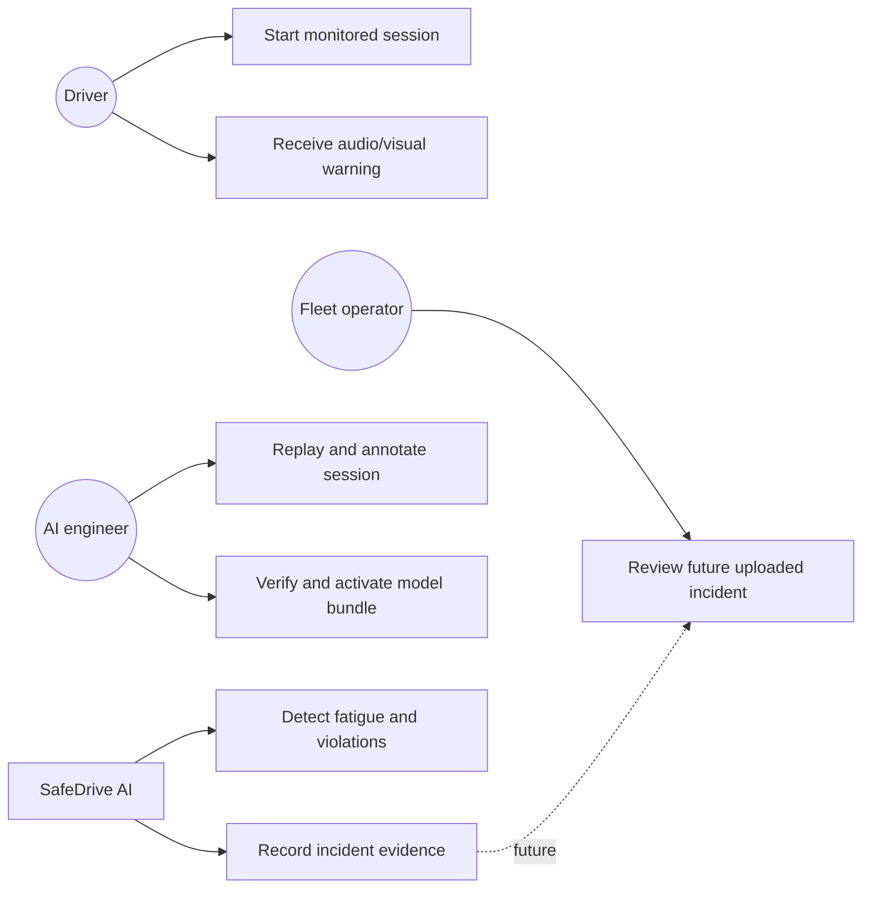

### 3.7.2 Activity Diagram

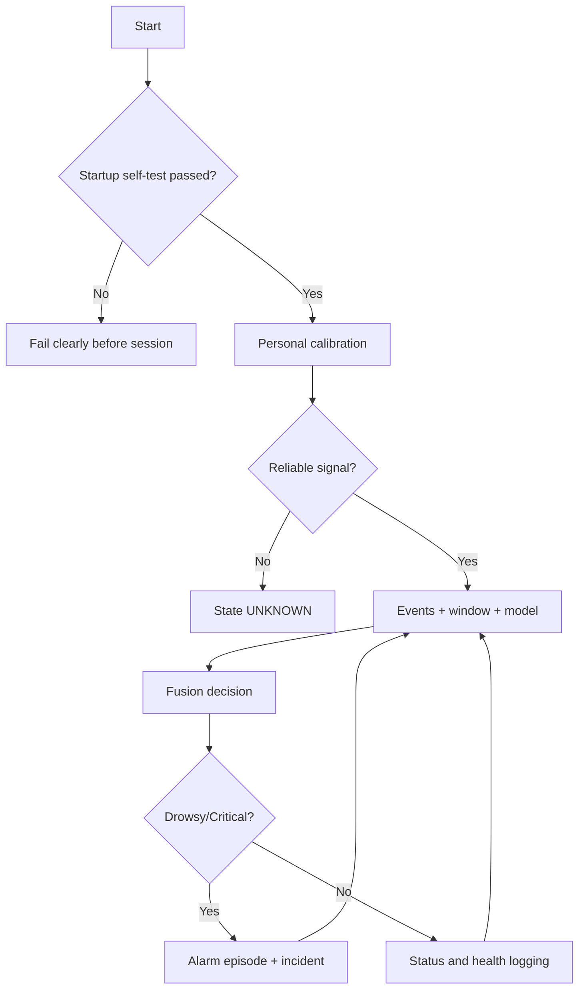

### 3.7.3 Sequence Diagram

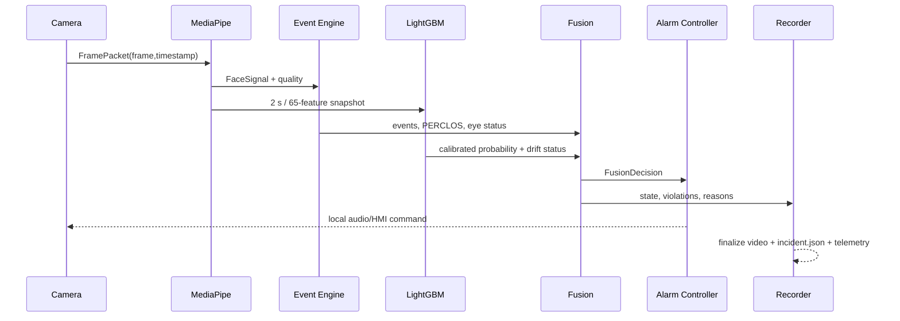

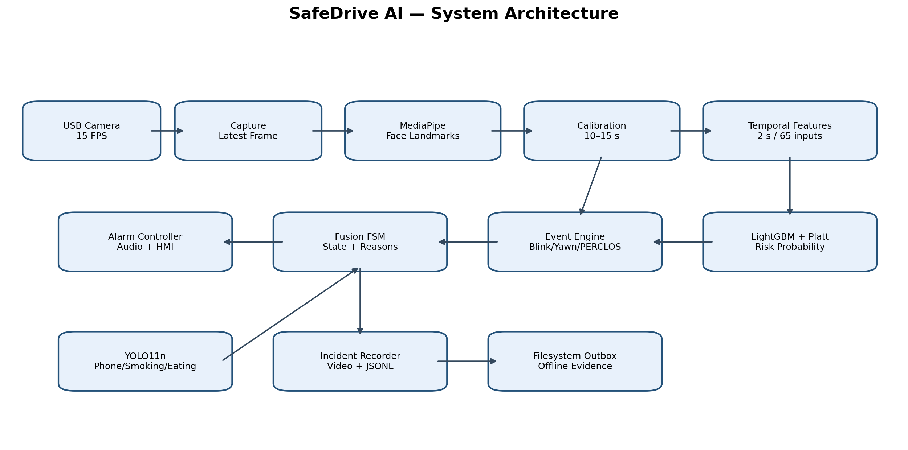

---

# الفصل الرابع: تصميم وبنية النظام

## 4.1 النظرة العامة

المسار التشغيلي هو Composition من وحدات مستقلة. `app.py` يربطها ولا ينفذ داخله
حساب EAR أو قواعد Fusion. يلتقط Capture أحدث frame، يمرره إلى MediaPipe، ثم تنقسم
الإشارة إلى مسار متوافق مع الموديل ومسار للأحداث. يرسل النموذج احتمالًا معايرًا،
بينما يرسل Event Engine أحداثًا وجودة وPERCLOS. تجمع Fusion كل ذلك مع EvidenceBus،
ثم ترسل القرار إلى Alarm وRecorder وTelemetry.

## 4.2 مكونات العتاد

- Raspberry Pi 5 بوصفه المنصة المضمنة المستهدفة الحالية، دون TPU أو مسرع خارجي.
- كاميرا USB قابلة لضبط 640×480 و15 FPS.
- سماعة النظام على اللابتوب، وعقد GPIO Buzzer للمنصة المضمنة.
- تخزين محلي للفيديو والحوادث والسجلات.
- شاشة أو HMI اختيارية للعرض المضبوط.

## 4.3 مكونات البرمجيات

| المكون | التقنية | المسؤولية |
|---|---|---|
| Capture | OpenCV | FramePacket وlatest-frame queue |
| Perception | MediaPipe Face Landmarker | landmarks وEAR/MAR/pose/gaze/quality |
| Temporal | Ring buffers + NumPy | نوافذ حسب الزمن وإعادة أخذ عينات |
| Model | LightGBM native model | احتمال خطر خام ثم Platt calibration |
| Events | Python FSM | Blink/Yawn/Closure/PERCLOS |
| Objects | Ultralytics YOLO11n | phone/cigarette/drink_or_food |
| Fusion | FSM | الحالة والمخالفات والأسباب |
| Alarm | Worker + PCM WAV | الصوت والتذكير والتصعيد |
| Recording | FFmpeg/OpenCV | Rolling incident evidence |
| Telemetry | JSONL rotating logs | التتبع والصحة وإعادة التحليل |

## 4.4 تدفق البيانات والـQueues

تُحد AI queue إلى عنصرين وتحتفظ بالأحدث. إذا تأخر الاستدلال تُسقط frames قديمة بدل
زيادة latency. يعمل Recorder وTelemetry في مسارين منفصلين بصفوف محدودة وعدادات
dropped frames. يعمل YOLO في process معزول لأن جمع MediaPipe/EGL وPyTorch في عملية
واحدة سبب native crash سابقًا؛ العزل يحمي الحلقة الأساسية.

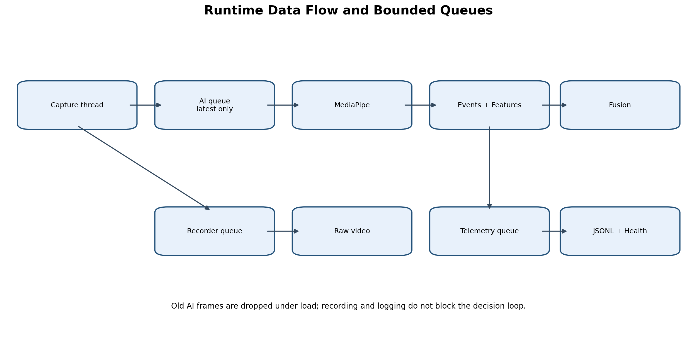

## 4.5 تصميم Backend والـAPIs — غير منفذ حاليًا

ينتهي التنفيذ الحالي عند `FilesystemOutboxSink`. التصميم المستقبلي يقترح API تقبل
Incident مكتملة بصورة idempotent باستخدام `incident_id`، وتعيد acknowledgment لكل
ملف قبل الحذف المحلي. ينبغي أن تشمل المصادقة، retry بزيادة زمنية، تشفير النقل،
إدارة النسخ، وسياسة retention. يمكن استخدام Flask داخل هذا المكون، لكن لا يصح وصفه
كتنفيذ قائم قبل توفر routes وقاعدة بيانات واختبارات تكامل.

## 4.6 تصميم Dashboard — غير منفذ حاليًا

تعرض اللوحة المقترحة قائمة الحوادث، المدة، أعلى حالة، المخالفات، أعلى probability،
عدد الرمشات والتثاؤب وPERCLOS، نسخة الموديل وسبب القرار، مع فيديو وtimeline. يجب ألا
تعرض احتمالًا منفردًا بوصفه حقيقة، بل تربطه بالـFusion Decision وجودة الإشارة.

## 4.7 Offline-first

لا تعتمد الكاميرا أو MediaPipe أو Fusion أو الإنذار على الشبكة. عند الانقطاع تحفظ
الحادثة في Outbox. عند عودة الاتصال يتولى Adapter مستقبلي الرفع وإعادة المحاولة،
ولا يحذف المحتوى إلا بعد إقرار الخادم. هذا الفصل يمنع الشبكة من تعطيل وظيفة السلامة.

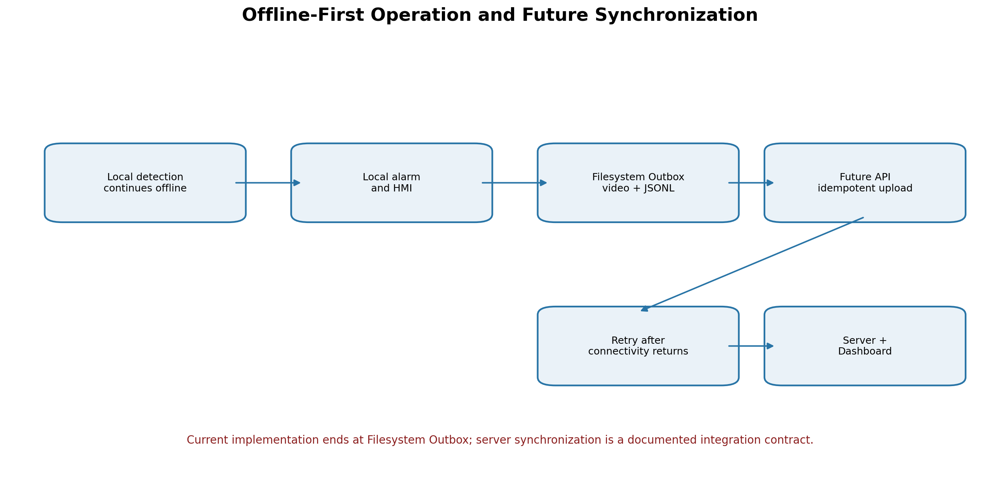

---

# الفصل الخامس: البيانات ونماذج الذكاء الاصطناعي واتخاذ القرار

## 5.1 مصادر البيانات وخصائص الوسم

استخدم المشروع بيانات NTHU وSUST وUTA في بناء train/test، واستخدم SAFEE كاختبار
إيجابي ضاغط فقط لعدم توفر سالب كافٍ فيه ضمن المسار المعتمد. كانت الوحدة الخام سطرًا
لكل frame مع timestamp وvideo_id وsubject_id وdataset_name وlabel وإشارات الوجه.
الوسم موروث من الفيديو، ولذلك لا يمثل Ground Truth دقيقًا لكل لحظة.

هذه النقطة تفسر جانبًا من FP: نافذة عين مفتوحة من فيديو مصنف نعسان تحمل label=1،
فتتعلم الخوارزمية أحيانًا خصائص الشخص أو المجال بدل الحدث الحقيقي. لذلك تستخدم
المقاييس Offline لقياس الاتفاق مع الوسم الموروث، ولا تساوي دقة سريرية.

## 5.2 تنظيف البيانات

استُخدم clipping فيزيائي للإشارات، ووحدات motion موحدة، ولم يطبق normalization عام.
منعت النوافذ من عبور video boundaries، وطلب اتفاق الوسوم داخل النافذة وتغطية 80%.
دُربت عتبات `mouth_open` حسب dataset من train فقط ودون labels، لكن ميزات
`mouth_open_*` الخاصة بالمجال استُبعدت من عقد الموديل النهائي لتقليل shortcut.

| الانقسام | الصفوف قبل التنظيف | الصفوف بعد التنظيف | النوافذ | Label 0 | Label 1 |
|---|---:|---:|---:|---:|---:|
| Train | 1,116,818 | 1,086,627 | 70,869 | 35,529 | 35,340 |
| Test | 264,653 | 263,852 | 15,844 | 8,184 | 7,660 |

## 5.3 القنوات Frame-level الثماني عشرة

| # | القناة | المعنى |
|---:|---|---|
| 1 | `ear` | متوسط فتحة العين |
| 2 | `eyes_closed` | مؤشر إغلاق مشتق في V3 |
| 3 | `face_velocity_x` | سرعة الوجه أفقياً بوحدة عرض وجه/ثانية |
| 4 | `face_velocity_y` | سرعة الوجه رأسياً بوحدة ارتفاع وجه/ثانية |
| 5 | `gaze_x` | اتجاه القزحية الأفقي المطبّع |
| 6 | `gaze_y` | اتجاه القزحية الرأسي المطبّع |
| 7 | `gaze_zone` | CENTER/LEFT/RIGHT/UP/DOWN/UNKNOWN |
| 8 | `head_motion` | تغير زوايا الرأس بالدرجة/ثانية |
| 9 | `left_ear` | فتحة العين اليسرى |
| 10 | `left_eye_closed` | مؤشر إغلاق العين اليسرى |
| 11 | `mar` | Mouth Aspect Ratio |
| 12 | `mouth_open` | مؤشر فتح الفم في V3 |
| 13 | `pitch` | ميل الرأس للأعلى والأسفل |
| 14 | `relative_ear` | EAR نسبة إلى baseline |
| 15 | `right_ear` | فتحة العين اليمنى |
| 16 | `right_eye_closed` | مؤشر إغلاق العين اليمنى |
| 17 | `roll` | الميل الجانبي للرأس |
| 18 | `yaw` | التفات الرأس يمينًا ويسارًا |

يستخدم Feature Schema النهائي 13 إشارة أساسية من هذه المجموعة لبناء الـ65 ميزة؛
أما المؤشرات الثنائية الخاصة بالعتبات وبعض القنوات الزائدة فلا تدخل إلى LightGBM.

## 5.4 النوافذ الزمنية و15 Hz

طول النافذة الفيزيائي ثانيتان، والخطوة نصف ثانية، والهدف 30 نقطة. لا تعني 15 Hz أن
النظام يأخذ 15 صورة فقط؛ بل يعني 15 عينة زمنية في الثانية. كاميرا 60 FPS قد تنتج
120 frame خلال النافذة وكاميرا 30 FPS تنتج 60 وكاميرا 15 FPS تنتج 30، ثم يعاد أخذ
العينات بالـtimestamp إلى 30 نقطة تمثل المدة نفسها. بذلك لا يعتمد القرار على عدد
frames الخام، بل على الزمن الفيزيائي.

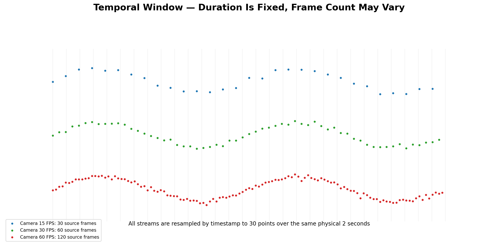

## 5.5 هندسة الميزات واختيارها

حوّل V3 كل قناة إلى إحصاءات وديناميكا: mean، min، max، q25، q75، variance، energy،
range، coefficient of variation، skewness، mean/max absolute change ونسب فئوية.
أنتج الملف النهائي 390 عمودًا تشمل metadata والميزات. بعد Validation وConsistency
Audit وSelection استقر عقد الإنتاج على 65 ميزة موزعة تقريبًا إلى 24 للعين، 16
لوضعية الرأس، 14 للنظر، 6 للفم و5 للحركة.

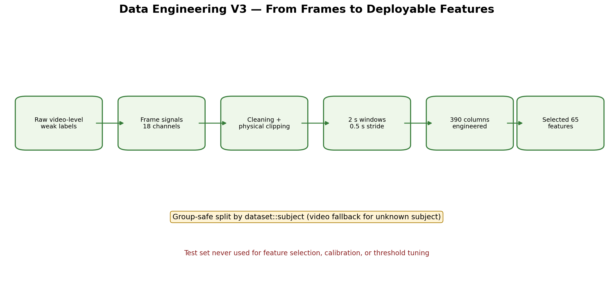

## 5.6 تقسيم البيانات ومنع التسرب

بُني group من `dataset_name::subject_id`، مع fallback إلى `video_id` إذا كان subject
مجهولًا. بقي test ثابتًا خارج اختيار الميزات والـhyperparameters والمعايرة والعتبة.
أُنتجت OOF predictions من grouped folds، واستخدمت في Platt calibration واختيار
operating point. كما نُفذ LODO لقياس القدرة على التعميم عند حجب dataset كاملة.

## 5.7 لماذا لا يكفي إطار واحد؟

لا يستطيع إطار واحد تمييز رمشة مدتها 100 ms عن إغلاق 1.5 s، ولا يعرف هل تغير EAR
بسبب ابتعاد الوجه أو النظر للأسفل. الزمن يكشف المدة والتكرار وسياق الفتح قبل الإغلاق
وبعده. لهذا لا يُسمح لنتيجة per-frame بإنتاج Critical.

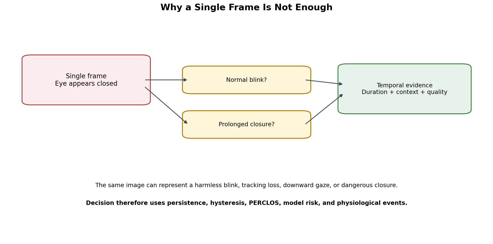

## 5.8 تجربة LSTM وGRU على Raw Temporal Data

استقبلت التجربة الأولى مصفوفة `(45,18)` تمثل 3 ثوانٍ عند 15 Hz. كانت بنية LSTM:
`Input → LSTM(64) → Dropout(0.30) → Dense(32, ReLU) → Dense(1, Sigmoid)`، وGRU
مماثلة باستبدال الخلية المتكررة. جرى التدريب بثلاثة seeds وclass weights وearly
stopping. بلغ متوسط test F1 نحو 60.7% للـGRU و54.2% للـLSTM، مع FPR نحو 64.7%
و62.1% على الترتيب.

جرب GRU V2 أربع مجموعات قنوات؛ اختيرت مجموعة `no_absolute_pose_gaze_13`. حققت
Recall=96.25% لكنها حققت Precision=48.51% وFPR=93.64% و185.36 false alerts/hour.
أي أنها تعلمت الميل إلى الإيجابي، وهو غير مقبول تشغيليًا. لذلك لم يُنشر GRU رغم
زمنيته، لأن الزمنية وحدها لا تعوض ضعف الوسوم وفجوة المجال.

## 5.9 LightGBM المعتمد

LightGBM ليس شبكة عصبية ولا يملك layers بالمعنى المعروف. إنه 38 شجرة Gradient
Boosting متتابعة، أقصى عمق 7 وحتى 26 ورقة للشجرة، learning rate نحو 0.032956.
يدخل إليه vector شكله `(65,)` ويخرج score واحدًا، ثم تحول sigmoid والمعايرة إلى
calibrated probability. لا يحتاج StandardScaler.

يحتوي Model Bundle على `model.txt`, `calibration.json`, `operating_point.json`,
`feature_schema.json`, `training_manifest.json`, `golden_samples.json`, checksums
وModel Card. يرفض Runtime bundle ذات hash أو schema غير مطابق، وقد حققت Golden
Samples parity ضمن `1e-6`.

## 5.10 Platt Calibration وDrift

تطبق Platt Calibration معاملات مدربة من OOF فقط لتقريب score من probability قابلة
للمقارنة. يحتفظ `feature_reference.json` بـq01/q99 لأهم الميزات. إذا خرج أكثر من
30% من أهم 20 feature عن المجال لثلاث نوافذ متتالية، يسجل النظام
`MODEL_INPUT_OOD` ويوقف مساهمة الموديل مؤقتًا، مع استمرار الأحداث الحرجة المستقلة.

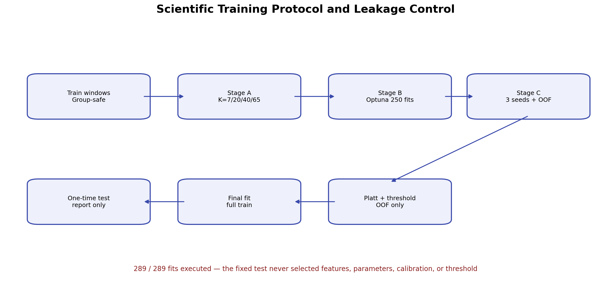

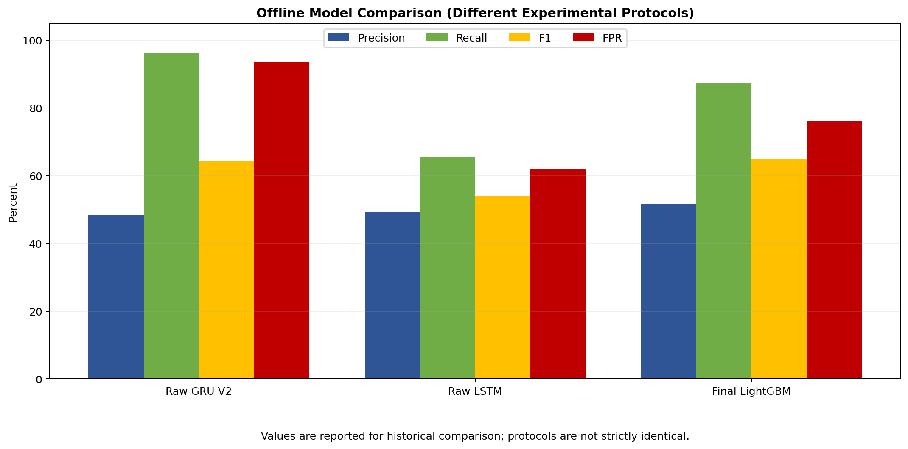

---

# الفصل السادس: Fusion وآلية تحديد الحالة والإنذار

## 6.1 لماذا Fusion؟

أظهر test أن LightGBM يحقق Recall مرتفعة نسبيًا لكنه ينتج FP كثيرة. رفع threshold
يقلل FP لكنه يفقد حالات كثيرة. بدل تحويل probability مباشرة إلى إنذار، تجمع Fusion
probability والأحداث وجودة القياس والذاكرة الزمنية. النتيجة Decision قابلة للتفسير،
لا Label مبهمة.

## 6.2 مسارا العين

- `model_ear`: يحافظ على صيغة V3 لضمان parity مع التدريب.
- `event_ear`: يحسب EAR قياسيًا من نقاط جفن متناظرة ولكل عين baseline مستقل.

يمنع الفصل تعديل إشارة الموديل عند إصلاح الرمش. تسجل الإشارة حالات VALID وGRACE
وLOST. تستمر GRACE لمدة 0.30 ثانية دون اختراع PERCLOS، وينتقل النظام إلى UNKNOWN
بعد فقد موثوق مستمر 0.50 ثانية خارج Critical.

## 6.3 المعايرة الشخصية

تبدأ المعايرة 10 ثوانٍ وتمتد إلى 15. تقبل frame إذا كانت جودة الوجه 0.55 أو أكثر
والـpose ضمن 25 درجة. يلزم 75 frame جيدة. يستخدم model baseline median، بينما
يستبعد event baseline أدنى 20% وأعلى 5% لتقليل أثر الرمش والقيم الشاذة. يسجل النظام
التشتت وعدم التناظر وأسباب الرفض. إذا فشلت المعايرة تصبح الحالة UNKNOWN.

## 6.4 Event Engine

يستخدم FSM للعين `UNKNOWN → OPEN → CLOSED → OPEN`. يبدأ الإغلاق عند relative EAR
≤0.60 ويؤكد الفتح عند ≥0.72. تحتسب رمشة إذا كان الإغلاق بين 0.05 و0.80 ثانية،
ويصبح أطول من ذلك Long Blink. يمنع الإغلاق الأحادي من Blink أو Critical، ويلزم
تزامن العينين ضمن 0.15 ثانية. يحسب PERCLOS بالمدة الفعلية للعين المغلقة، لا بعدد
frames، ويؤجل استخدامه حتى تتوفر مدة وتغطية موثوقتان.

يتطلب Strong Bilateral Closure تغطية 80% داخل 1.5 ثانية، median لقيمة العين الأعلى
≤0.30، و80% من العينات تحت 0.40، مع استبعاد downward gaze الموثوق. يبدأ Yawn عندما
يتجاوز MAR النسبي 1.55 لمدة 1.2–8 ثوانٍ. ويكتشف Head Nod من تغير pitch يبلغ نحو
18 درجة ضمن مدة مناسبة.

## 6.5 حالات Fusion

| الحالة | المعنى | شرط نموذجي |
|---|---|---|
| UNKNOWN | قياس أو معايرة غير موثوقين | فقد الوجه أو signal stale |
| NORMAL | بيانات موثوقة ولا دليل خطر | risk تحت 0.42 مع persistence |
| FATIGUE_WARNING | دليل متوسط أو تراكم أولي | model≥0.55 مع دليل مساعد |
| DROWSY | نعاس مدعوم فسيولوجيًا | model≥0.75 مع دليل أو PERCLOS موثوق |
| CRITICAL | خطر فوري | Strong bilateral closure ≥1.5 s فقط |

تطبق EWMA بـalpha=0.35، وعتبات دخول وخروج مختلفة: warning enter=0.55 وexit=0.42،
drowsy enter=0.75 وexit=0.58. يمنع Hysteresis التذبذب. يحتاج Warning ثانيتين،
Drowsy 1.5 ثانية، وNormal 3 ثوانٍ. في النسخة 2.4 يمكن إظهار Drowsy قبل Critical
بعد 0.5 ثانية من إغلاق ثنائي قوي إذا كان risk≥0.75، لكن Critical لا تنتظر الموديل
بعد اكتمال 1.5 ثانية.

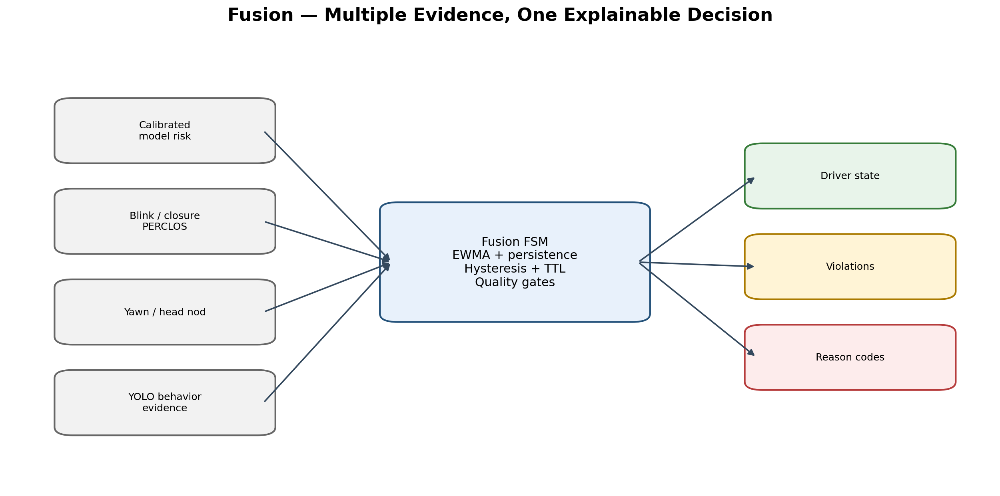

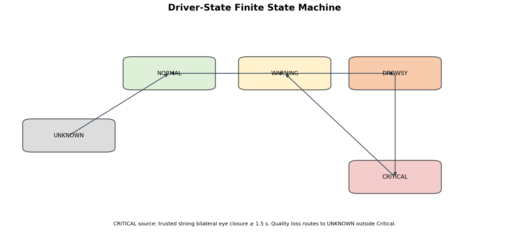

## 6.6 فصل الحالة عن المخالفة

التثاؤب والهاتف والتدخين والأكل مخالفات يمكن أن تكون موجودة مع `NORMAL`. لا يحول
Yawn منفرد السائق إلى Fatigue، ولا يحول Phone إلى Drowsy. يبقى `driver_state`
مخصصًا لحالة التعب، بينما `violations` قائمة مستقلة. هذا يمنع خلط نوعي الخطر ويسهل
إضافة detector جديد.

## 6.7 Alarm Controller

Fusion تصدر حالة كل دورة، لكن Alarm Controller يصدر أمرًا عند حدث زمني فقط:

- Drowsy onset: نغمة 750 Hz مدة 0.45 ثانية، ثم reminder كل 10 ثوانٍ.
- Critical onset: نبضتان 0.70 ثانية عند 1100 و1400 Hz بفاصل 0.20 ثانية، ثم reminder
  كل 4 ثوانٍ؛ وإذا استمرت 15 ثانية يصبح كل 2.5 ثانية.
- ثلاث Drowsy episodes خلال 60 ثانية أو استمرار 30 ثانية ينتجان escalation من ثلاث
  نبضات قصيرة، ثم reminder كل 7 ثوانٍ.
- فتح موثوق 0.5 ثانية يوقف الصوت، بينما تبقى Fusion في recovery حتى 3 ثوانٍ.
- Warning وYawn وUnknown لا تطلق صوت Drowsy.

تشغل طبقة الصوت worker مستقلًا وصف أولوية محدودًا. يستطيع Critical قطع صوت Drowsy.
في Replay يستخدم Null/Log-only output ولا تصدر أصوات حقيقية.

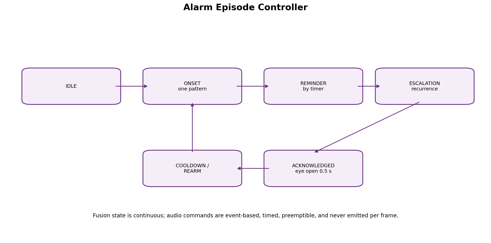

---

# الفصل السابع: إدارة الأحداث والفيديو

## 7.1 مفهوم Incident

Incident وحدة أدلة تبدأ عند حالة أو مخالفة تستحق التسجيل. لا تساوي كل frame ولا كل
probability مرتفعة Incident مستقلة. تحمل incident_id، البداية والنهاية، أعلى حالة،
المخالفات، أعلى probability، ملخص blink/yawn/PERCLOS، reason codes، نسخ العقود
وhash الفيديو.

## 7.2 التسجيل الدائري

يستقبل Rolling Recorder كل frame ويحتفظ buffer مضغوطة. عند trigger يحفظ 10 ثوانٍ
قبل الحدث وكامل الحدث و10 ثوانٍ بعده. تدمج الأحداث بفاصل أقل من 5 ثوانٍ. يقسم clip
إذا تجاوز 60 ثانية إلى أجزاء مترابطة. يستخدم FFmpeg/H.264 ويعود إلى OpenCV mp4v إذا
فشل startup probe.

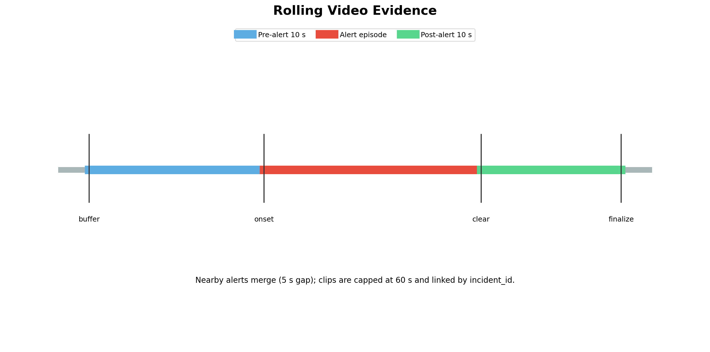

## 7.3 البيانات الوصفية

```text
incidents/outbox/<incident_id>/
├── video.mp4
├── incident.json
└── telemetry.jsonl
```

يربط JSON الفيديو والقرار والقيم والإصدارات. أما Telemetry فتحتوي مراحل Capture،
Perception، Calibration، Events، Window، Model، Fusion، Alarm، Recorder وHealth.

## 7.4 العمل دون إنترنت

يستمر النظام محليًا لأن CompanyUploadAdapter لا يعمل داخل AI loop. تحفظ Outbox حتى
عودة الاتصال. العقد المستقبلي idempotent ويستخدم incident_id ويمنع الحذف قبل
acknowledgment. لا توجد مزامنة فعلية ضمن النسخة الحالية.

## 7.5 إدارة مساحة التخزين

تستخدم logs تدويرًا بحجم 20 MB وخمس نسخ في الإعداد التجريبي. يجب أن تضيف النسخة
الإنتاجية quota للحوادث، وسياسة حذف تبدأ بالأقدم بعد نجاح الرفع، وحدًا أدنى للمساحة
الحرة. لا يجوز حذف ActiveIncident أو ملف قبل اكتمال hash وmetadata.

## 7.6 الخصوصية والأمان

لا ينفذ المشروع تعرفًا على هوية السائق. المعالجة محلية، ويحتفظ فقط بما يلزم
للتقييم والحوادث. توصي اللائحة الأوروبية بتشغيل DDAW دون biometric recognition
وبالاحتفاظ بالبيانات اللازمة ضمن closed-loop [2]. يجب في الإنتاج تشفير التخزين
والنقل، تقييد الوصول، تحديد retention، وتوثيق الموافقة والغرض.

---

# الفصل الثامن: تنفيذ النظام

## 8.1 بيئة التطوير

استُخدمت Python 3، OpenCV، MediaPipe، NumPy، pandas، LightGBM، scikit-learn،
Ultralytics/PyTorch، FFmpeg، pytest وGoogle Colab للتدريب. عملت هندسة الميزات على
CPU، بينما استفادت تجارب LSTM/GRU من GPU. لا يتطلب LightGBM صغير الحجم GPU في
Colab، ويعمل استدلاله على CPU في المنصة المستهدفة.

## 8.2 تنفيذ خط معالجة الفيديو

ينتج `LatestFrameCapture` كائن `FramePacket` يحوي frame_id وUTC وmonotonic
timestamps. تستقبل `MediaPipeFacePerception` frame وتحسب landmarks وإشارات الوجه.
تتحقق من min face width ratio=0.20 وinterocular distance=50 px وeye width=24 px؛
وإذا كان السائق بعيدًا جدًا تسجل `DRIVER_TOO_FAR` بدل اختراع قرار عين.

## 8.3 MediaPipe والمعالجة الأولية

Face Landmarker مصمم للعمل على الصور والفيديو ويخرج landmarks ثلاثية الأبعاد [6].
يحسب المشروع EAR بطريقتين، MAR، pose، iris offsets، gaze zone، جودة العين وسرعة
الحركة. لا تدخل الصورة الخام إلى LightGBM.

## 8.4 تنفيذ الموديل

يقرأ `LightGBMRuntimePredictor` model.txt الأصلي، ويطلب vector من
`V3RuntimeFeatureBuilder` بترتيب feature_schema. تطبق المعايرة وتصدر
`ModelPrediction` يحوي raw_score وcalibrated_probability وmodel_version. يتحقق
`FeatureDriftMonitor` قبل تفعيل مساهمة الموديل.

## 8.5 تنفيذ YOLO11n

استُخدم checkpoint جاهز من مشروع `driver-inattention-detection` عند commit موثق،
بحجم يقارب 5.2 MB وسبع فئات مصدرية. فعّلنا phone وcigarette وdrink_or_food فقط.
لم نعد تدريبه، ولا تتوفر في المصدر metrics كافية لكل فئة، كما يجب مراجعة توافق ترخيص
AGPL-3.0 أو الترخيص المؤسسي قبل الاستخدام التجاري [8], [9]. يعمل كل 0.5 ثانية في
process معزول، ويحتاج 3 عينات وactivation ratio=60% ضمن 1.5 ثانية.

## 8.6 تنفيذ Fusion والإنذار

`FusionStateMachine` لا يقرأ frame؛ يستقبل ModelPrediction وEvent snapshot وأدلة
حديثة من EvidenceBus. ينتج `FusionDecision` بقيم active_state وtarget_state
والviolations والalarm_level والreason_codes وأزمنة candidate/recovery. يستقبل
`AlarmController` القرار مع monotonic clock ويصدر `AlarmCommand` إلى
`LinuxAudioOutput` أو `NullAlarmOutput` أو عقد `GPIOBuzzerOutput`.

## 8.7 تنفيذ Logging وHMI

يعرض Live Status مرتين في الثانية: state، target، recovery، eye observation، model
probability، drift، closure، PERCLOS، blink، yawn، objects، FPS وdropped frames.
يسجل DEBUG كل مرحلة وكامل feature vector، بينما يقلل NORMAL التفاصيل. ترسم HMI
الشريط الكهرماني لـDrowsy والأحمر اللامع 2 Hz لـCritical، وترسم YOLO boxes على نسخة
العرض فقط؛ الفيديو الخام لا يتغير.

## 8.8 Backend وAPIs

المنفذ حاليًا هو `IncidentSink` المجرد و`FilesystemOutboxSink`. يحتوي
`CompanyUploadAdapter` على عقد واضح لكنه غير منفذ. لذلك لا توجد Flask routes أو
قاعدة بيانات أو Dashboard يمكن اختبارها في هذه النسخة.

## 8.9 دمج النظام

يتحقق startup من deployment mode وModel Bundle وGolden Samples والكاميرا وMediaPipe
والـrecorder وYOLO والصوت. يمنع `EXPERIMENTAL + ACTIVE`، ويسمح بـSHADOW مع Local
Audio Demo صريح. في Replay يفرض الصوت الصامت حتى إذا كان config المحلي مفعّلًا.

## 8.10 النشر على المنصة المضمنة المستهدفة

الهدف Raspberry Pi 5 دون AI accelerator. يجب نقل Model Bundle نفسه دون تصدير إلى
TFLite؛ LightGBM ليس TensorFlow model، وصيغته الأصلية model.txt أخف وأوضح. ينبغي
قبل الاعتماد تشغيل checksum وGolden parity، ثم soak test لمدة 30 دقيقة وقياس FPS
وlatency وCPU/RAM/temperature والدropped frames. هذه القياسات أهداف قبول وليست نتائج
منجزة مثبتة في الملفات الحالية.

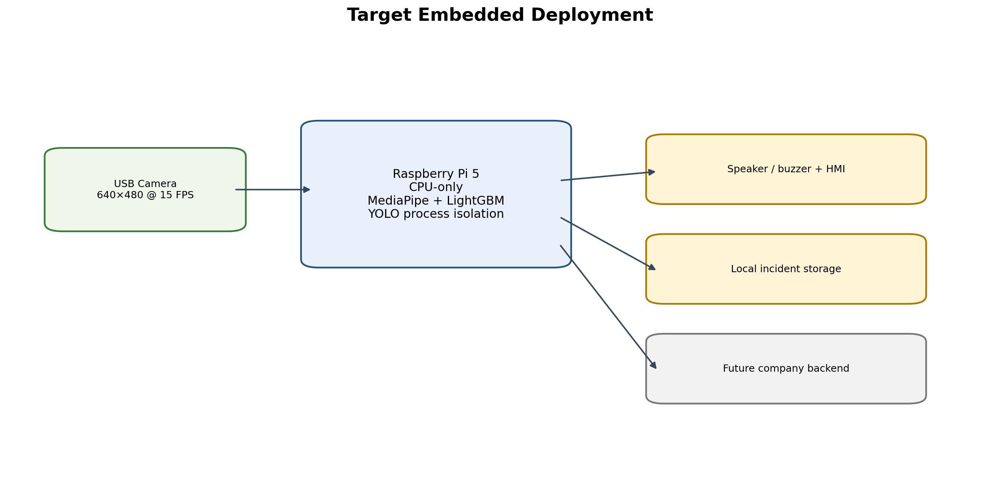

## 8.11 صور من جلسة النظام

اللقطات التالية مستخرجة من جلسة التقييم الحقيقية `raspberry-live-8dce40a9`، مع
تمويه منطقة الوجه لحماية الخصوصية. هي دليل على وجود تسجيل جلسة كاملة، وليست وحدها
دليلًا على صحة التصنيف.


---

# الفصل التاسع: الاختبارات والنتائج

## 9.1 منهجية الاختبار

بدأ كل package بـSmoke Run للتحقق من schema والتدفق. شغلت Stage A أربع أحجام ميزات
في خمسة grouped folds. شغلت Stage B أفضل قائمتين عبر 25 Optuna trial وخمسة folds،
أي 250 fit. أعادت Stage C أفضل الإعدادات على seeds 42 و43 و44 وأنتجت OOF. أضيفت
ثلاثة LODO fits وfinal fit، ليصبح الإجمالي 289/289. لم يستخدم test في القرار.

## 9.2 مقاييس التصنيف

```text
Precision = TP / (TP + FP)
Recall    = TP / (TP + FN)
F1        = 2 × Precision × Recall / (Precision + Recall)
FPR       = FP / (FP + TN)
```

لا تعتمد الدراسة Accuracy وحدها لأن زمن اليقظة قد يطغى على الحالات الإيجابية.
تضاف PR-AUC وROC-AUC، وعلى Runtime تضاف false alerts/hour وepisode recall وdelay.

## 9.3 نتائج LightGBM Offline

اختير 65 feature وOOF threshold=0.317. لم تحقق OOF القيود المطلوبة؛ لذلك صنف
Model Bundle EXPERIMENTAL.

| المقياس | OOF | Fixed Test |
|---|---:|---:|
| Precision | 54.87% | 51.61% |
| Recall | 91.08% | 87.43% |
| F1 | 68.48% | 64.91% |
| FPR | 74.31% | 76.20% |
| PR-AUC | 70.81% | 67.53% |
| ROC-AUC | 69.57% | 65.41% |

مصفوفة test: TN=1,948، FP=6,236، FN=956، TP=6,651. تعني FPR المرتفعة أن
النموذج لا يجوز أن يطلق إنذارًا وحده رغم Recall الجيدة.

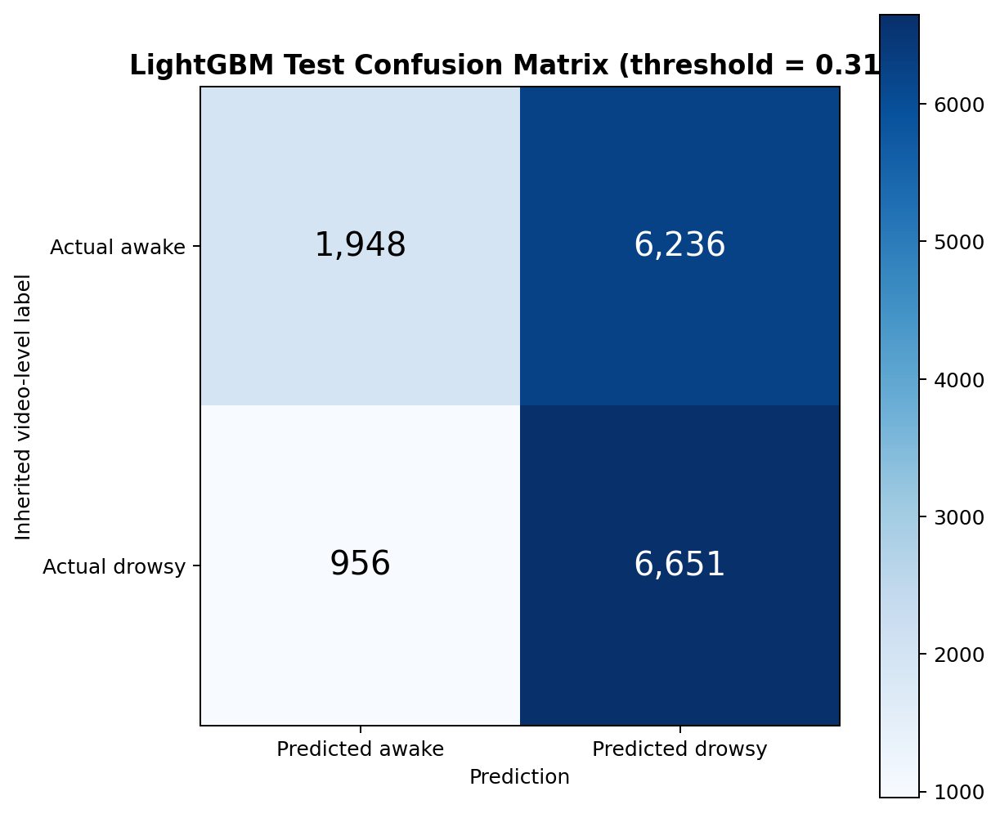

## 9.4 النتائج حسب Dataset

| Dataset | Windows | Precision | Recall | F1 | FPR | PR-AUC | ROC-AUC |
|---|---:|---:|---:|---:|---:|---:|---:|
| NTHU | 391 | 39.60% | 49.69% | 44.08% | 53.04% | 47.95% | 49.31% |
| SUST | 5,316 | 52.74% | 90.63% | 66.68% | 71.40% | 64.33% | 66.88% |
| UTA | 10,084 | 51.33% | 87.05% | 64.58% | 79.88% | 69.65% | 65.15% |

ينخفض NTHU قرب الأداء العشوائي، وتختلف FPR بشدة بين المجالات. هذا دليل Domain
Shift واحتمال تعلم خصائص dataset أو subject. بلغ SAFEE positive stress mean
probability=0.720 وpositive rate=100% على 53 نافذة، لكنه لا يقيس FP لغياب سالب كافٍ.

## 9.5 نتائج النماذج الزمنية

| التجربة | Test Precision | Test Recall | Test F1 | Test FPR | القرار |
|---|---:|---:|---:|---:|---|
| Raw GRU average | 52.77% | 75.22% | 60.70% | 64.72% | غير معتمد |
| Raw LSTM average | 49.19% | 65.55% | 54.16% | 62.06% | غير معتمد |
| GRU V2 selected | 48.51% | 96.25% | 64.51% | 93.64% | مرفوض تشغيليًا |

الاستنتاج ليس أن GRU سيئ بنيويًا؛ بل أن البيانات والوسوم وبروتوكول المجال لم تدعم
تعميمه. نموذج زمني قوي يحتاج labels زمنية وسائقين منفصلين وhard negatives حقيقية.

## 9.6 Runtime Regression بعد Fusion

أعيد تشغيل جلسة `raspberry-live-8dce40a9` بناءً على وصف يدوي تقريبي للفترات. أخذت
عينة كل 0.5 ثانية واستبعد UNKNOWN السالب من مقام FPR. النتائج:

| المقياس | Runtime السابق | Runtime V2.2 |
|---|---:|---:|
| Precision | 55.7% | 81.6% |
| Recall | 78.3% | 79.2% |
| F1 | 65.1% | 80.4% |
| FPR | 17.1% | 4.9% |
| FP time | 33.0 s | 9.5 s |
| False standalone Critical | موجود | صفر |

كانت مصفوفة الزمن: TP=42.0s، FP=9.5s، TN=185.5s، FN=11.0s، مع 8 ثوانٍ
UNKNOWN أثناء اليقظة. اكتشفت الفترات الموجبة الثلاث، لكن delays كانت 2.07 و3.00
و3.27 ثانية، أي median=3.00 ثوانٍ. اكتشف التثاؤبان دون Drowsy أو صوت. بقي FP في
معظمه ذيل recovery بعد Critical.

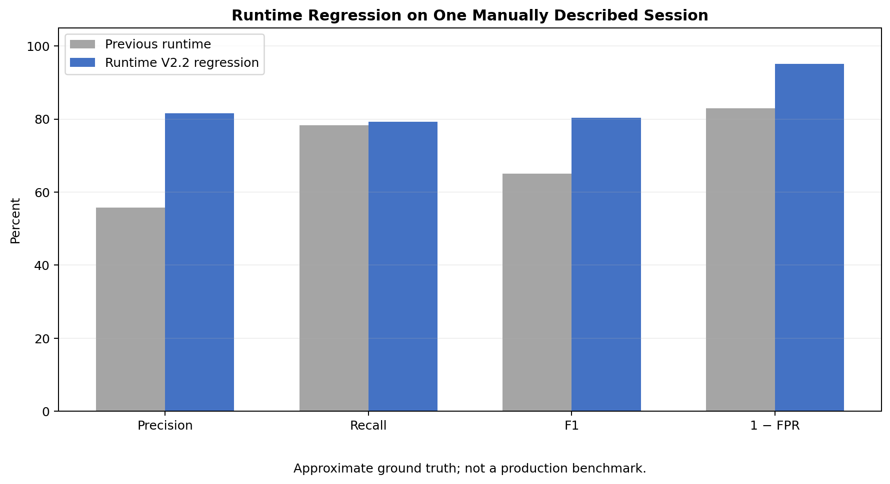

## 9.7 اختبار الإنذار

أثبت Replay أن كل انتقال خطر ينتج onset واحدًا لا أمرًا لكل frame. بدأت Drowsy أمرًا
ثم reminder بعد 10 ثوانٍ. أنتج Critical onset ثم reminders كل 4 ثوانٍ. سجل Replay
الأوامر كـLOG_ONLY ولم يشغل جهاز الصوت. تختبر الوحدة 100 frame Critical وتتوقع onset
واحدًا، كما تختبر preemption وacknowledgment وفشل backend.

## 9.8 اختبارات العقود والتكامل

- فصل train/validation/test وعدم overlap.
- استبعاد metadata وdataset-specific features.
- حفظ feature order والتحقق من checksums.
- Golden parity بين Colab وRuntime ضمن `1e-6`.
- Blink من frame واحد عند 15 FPS مرة واحدة.
- إغلاق عين واحدة لا ينتج Critical.
- فقد قصير لا يذبذب Critical وUnknown.
- Yawn منفرد لا يغير DriverState.
- Replay لا يشغل الصوت.
- الفيديو الخام لا يتأثر بـHMI overlay.
- Evidence TTL ينتهي ولا يبقى detector stale.

بلغت آخر حزمة اختبارات Runtime المستهدفة 56 اختبارًا ناجحًا، مع خطأ Golden calibrated
probability في حدود الدقة العائمة وأقل بكثير من `1e-6`.

## 9.9 الأداء على العتاد النهائي

الأهداف المحددة هي capture قريب من 15 FPS، model p95<20 ms، Fusion p95<5 ms،
decision latency<0.7 s، dropped recording frames<1% وذاكرة مستقرة خلال 30 دقيقة.
لا توجد ضمن الأدلة الحالية نتائج benchmark رسمية كاملة على Raspberry Pi 5؛ لذلك
تسجل هذه القيم كـAcceptance Targets وليست نتائج متحققة.

## 9.10 قرار البوابة

نجح Runtime Regression في Precision وF1 وFPR ومنع False Critical، لكنه فشل هدف
Recall≥90% وmedian delay≤2s. لذلك الحالة الصحيحة هي:

```text
SHADOW / CONTROLLED DEMO
Model bundle: EXPERIMENTAL
Production readiness: NOT ACHIEVED
```

---

# الفصل العاشر: التحديات والقيود والمخاطر

## 10.1 التحديات التقنية

### الإضاءة والنظارات

تتغير دقة landmarks والقزحية في الإضاءة الضعيفة، وقد تحجب النظارات الانعكاسية أو
الشمسية الجفن. يلزم اختبار نهاري/ليلي وربما IR camera في النسخة اللاحقة.

### حجب الوجه وموضع الكاميرا

اليد أو الهاتف أو الكمامة أو زاوية جانبية تقلل جودة القياس. إذا ابتعد السائق وصغر
عرض الوجه أو العين عن الحدود، يعطّل النظام دليل العين بدل تصنيفها مغلقة.

### اهتزاز السيارة

قد يرفع الاهتزاز head_motion وface_velocity. يجب تثبيت الكاميرا واختبار فيديو قيادة
حقيقي، وفصل حركة الكاميرا عن حركة الرأس مستقبلًا.

### اختلاف السائقين

شكل العين والوجه والنظارات والعادات تختلف؛ تخفف المعايرة ذلك لكنها لا تعوض تدريبًا
متعدد السائقين. يلزم split صارم على driver.

### الوسوم الضعيفة وDomain Shift

الوسم على مستوى الفيديو هو القيد العلمي الأكبر. تعكس نتائج NTHU وLODO اختلافًا
مجاليًا. Fusion تقلل الضرر لكنها لا تصلح Ground Truth الخاطئة.

## 10.2 القيود الحالية

- تجربة قبول بشرية محدودة وعلى شخص واحد ووصف زمني تقريبي.
- YOLO جاهز دون metrics مستقلة على كاميرا المشروع.
- عدم توفر benchmark نهائي موثق على Raspberry Pi 5.
- Backend وDashboard والرفع غير منفذة.
- لا يوجد تعرف على هوية السائق، ولا يجب تقديم النظام كتشخيص طبي.

## 10.3 مخاطر النظام وإجراءات الحد منها

| الخطر | الأثر | التخفيف الحالي/المقترح |
|---|---|---|
| False alarm | إزعاج وفقد ثقة | Fusion، persistence، reminders محدودة |
| False negative | عدم تنبيه خطر | إغلاق Critical مستقل، جمع positives أفضل |
| Tracking error | قرار عين خاطئ | quality gates، DRIVER_TOO_FAR، UNKNOWN |
| Model OOD | shortcut مجالي | drift monitor وتعطيل مساهمة الموديل |
| صوت غير متاح | غياب التنبيه | startup probe، HMI، health error |
| امتلاء التخزين | فقد الأدلة | quota/retention مستقبلية وrotating logs |
| كشف بيانات شخصية | خطر خصوصية | local processing، access control، encryption |
| ترخيص YOLO | خطر قانوني | مراجعة AGPL/Enterprise وترخيص الوزن المصدر |

---

# الفصل الحادي عشر: التحسينات المستقبلية

1. جمع فيديوهات الشركة من عشرة سائقين على الأقل مع annotations زمنية مستقلة.
2. فصل drivers بين train وtuning وacceptance ومنع التعديل بعد مشاهدة acceptance.
3. إعادة تدريب ميزات relative per-eye EAR وpose deltas وتقليل absolute shortcuts.
4. استخدام hard negatives من FP موثقة أو OOF فقط، لا من test النهائي.
5. إعادة تقييم GRU/TCN/Transformer بعد تحسين labels، لا لمجرد زيادة التعقيد.
6. إعادة تدريب detector المقصورة على الهاتف والتدخين والأكل من زاوية الكاميرا الفعلية.
7. تصدير YOLO إلى NCNN أو صيغة ARM مناسبة بعد قياس الدقة والسرعة.
8. تنفيذ CompanyUploadAdapter وBackend APIs وDashboard مع security وretention.
9. إضافة سياق المركبة مثل السرعة وزاوية المقود إذا أصبح متاحًا.
10. تنفيذ Raspberry soak/thermal benchmark واختبارات نهار/ليل/نظارات/اهتزاز.
11. تحديد سياسة إنذار لكل مخالفة بالتعاون مع خبراء Human Factors.
12. الانتقال من Controlled Demo إلى Pilot ثم Production Validation ببوابات مستقلة.

---

# الفصل الثاني عشر: إدارة المشروع وتقسيم العمل

## 12.1 مراحل التطوير

| المرحلة | المخرج الرئيسي |
|---|---|
| استخراج الإشارات | Frame-level CSVs من الفيديوهات |
| Feature Engineering V3 | نوافذ ثانيتين و390 عمودًا |
| Validation/Audit | تقارير الجودة والاتساق ومخاطر leakage |
| Feature Selection | عقد 65 feature |
| Raw Temporal Experiments | LSTM/GRU ومقارنة الانهيار |
| LightGBM Training | 289 fits وModel Bundle |
| Runtime Integration | MediaPipe + model + events + telemetry |
| Fusion repair | تقليل FP وفصل التعافي والجودة |
| Alarm/Recorder | صوت متدرج وفيديو حادثة |
| YOLO integration | phone/smoking/eating تجريبيًا |
| Evaluation | تسجيل، وسم، replay وregression |

## 12.2 الجدول الزمني

ينبغي استكمال تواريخ البداية والنهاية الفعلية من سجل الفريق. يقترح تمثيلها في Gantt
بأعمدة: جمع البيانات، هندسة الميزات، التدريب، Runtime، Fusion، تكامل السلوكيات،
الاختبار، التوثيق والتسليم.

## 12.3 توزيع المهام بين أعضاء الفريق

> يجب تعبئة هذا الجدول من أعضاء الفريق قبل التسليم؛ لم تُختلق مساهمات غير موثقة.

| العضو | المهام الفعلية | الملفات/المخرجات | التجارب والاختبارات | مساهمة التوثيق |
|---|---|---|---|---|
| محمد عاشور | `[يُستكمل]` | `[يُستكمل]` | `[يُستكمل]` | `[يُستكمل]` |
| محمد حمزة مقداد | `[يُستكمل]` | `[يُستكمل]` | `[يُستكمل]` | `[يُستكمل]` |
| محمد معاذ سويد | `[يُستكمل]` | `[يُستكمل]` | `[يُستكمل]` | `[يُستكمل]` |
| أحمد سعود | `[يُستكمل]` | `[يُستكمل]` | `[يُستكمل]` | `[يُستكمل]` |
| طارق صباغ التاجي | `[يُستكمل]` | `[يُستكمل]` | `[يُستكمل]` | `[يُستكمل]` |

## 12.4 أدوات إدارة المشروع

استخدم Git لتتبع المصدر، Google Drive وColab للتدريب، JSON manifests وchecksums
للتكرار، pytest للاختبار، CSV/Markdown للتقارير، وReplay/JSONL لتحليل Runtime.
ينبغي إضافة أداة الفريق الفعلية لتوزيع المهام إن وجدت.

## 12.5 المساهمات الفردية

يجب أن تصاغ كل مساهمة بصيغة قابلة للتحقق: «نفذ الطالب package كذا، أنتج الملف كذا،
شغل التجربة كذا، وراجع النتيجة كذا»، لا بصياغة عامة مثل «شارك في الذكاء الاصطناعي».

---

# الفصل الثالث عشر: الخاتمة

بدأ المشروع من مشكلة تبدو ثنائية: هل السائق نعسان أم لا؟ لكن تحليل البيانات والتجارب
أظهر أن الحل الواقعي يجب أن يكون نظامًا لا مصنفًا منفردًا. فوسوم الفيديو الضعيفة
وDomain Shift رفعت FP في LSTM وGRU وLightGBM. استُخدم LightGBM الخفيف كدليل مساعد،
وبُني حوله Event Engine ومعايرة شخصية وFusion FSM وAlarm Controller وتسجيل فيديو
وTelemetry وواجهة Evidence لإضافة السلوكيات.

حقق Fusion تحسنًا واضحًا في جلسة Regression واحدة، فارتفعت Precision من 55.7% إلى
81.6% وانخفضت FPR من 17.1% إلى 4.9%، مع إزالة False Critical المستقل. لكن Recall
79.2% وتأخير 3 ثوانٍ لم يحققا البوابة المطلوبة. القيمة الأساسية للمشروع هي معمارية
قابلة للتفسير والتطوير والاختبار على الحافة، مع توثيق صريح لعدم اليقين. المرحلة
القادمة ليست زيادة طبقات النموذج بصورة عشوائية، بل جمع Ground Truth زمني متعدد
السائقين، قياس العتاد النهائي وإغلاق حلقة التقييم قبل الإنتاج.

---

# المراجع

[1] World Health Organization, “Road traffic injuries,” Dec. 13, 2023. [Online].
Available: https://www.who.int/news-room/fact-sheets/detail/road-traffic-injuries

[2] European Commission, “Commission Delegated Regulation (EU) 2021/1341 — Driver
drowsiness and attention warning systems,” Official Journal of the European Union,
2021. [Online]. Available:
https://eur-lex.europa.eu/legal-content/EN/TXT/?uri=CELEX:32021R1341

[3] T. Soukupová and J. Čech, “Real-Time Eye Blink Detection using Facial
Landmarks,” Center for Machine Perception, Czech Technical University, 2016.
[Online]. Available: https://cmp.felk.cvut.cz/ftp/articles/cech/Soukupova-TR-2016-05.pdf

[4] D. Sommer et al., “PERCLOS-based technologies for detecting drowsiness:
current evidence and future directions,” *Sleep Advances*, 2023. [Online].
Available: https://pmc.ncbi.nlm.nih.gov/articles/PMC10108649/

[5] National Tsing Hua University Computer Vision Laboratory, “Driver Drowsiness
Detection Dataset,” 2016. [Online]. Available:
https://cv.cs.nthu.edu.tw/php/callforpaper/datasets/DDD/

[6] Google AI Edge, “Face landmark detection guide for Python — MediaPipe Face
Landmarker.” [Online]. Available:
https://developers.google.com/edge/mediapipe/solutions/vision/face_landmarker/python

[7] G. Ke et al., “LightGBM: A Highly Efficient Gradient Boosting Decision Tree,”
in *Advances in Neural Information Processing Systems 30*, 2017. [Online].
Available:
https://proceedings.neurips.cc/paper/2017/hash/6449f44a102fde848669bdd9eb6b76fa-Abstract.html

[8] G. Jocher and J. Qiu, “Ultralytics YOLO11,” software, 2024. [Online].
Available: https://docs.ultralytics.com/models/yolo11/

[9] Ultralytics, “Ultralytics Licensing: AGPL-3.0 and Enterprise.” [Online].
Available: https://www.ultralytics.com/license

[10] C.-H. Weng, Y.-H. Lai, and S.-H. Lai, “Driver Drowsiness Detection via a
Hierarchical Temporal Deep Belief Network,” ACCV Workshop, 2016.

[11] C. Lugaresi et al., “MediaPipe: A Framework for Building Perception
Pipelines,” arXiv:1906.08172, 2019. [Online]. Available:
https://arxiv.org/abs/1906.08172

[12] Raspberry Pi Ltd., “Raspberry Pi 5 product and documentation.” [Online].
Available: https://www.raspberrypi.com/documentation/computers/raspberry-pi.html

---

# الملاحق

## الملحق أ: العقود العامة

| العقد | أهم الحقول | المنتج/المستهلك |
|---|---|---|
| FramePacket | frame, frame_id, utc, monotonic | Capture → Perception/Recorder |
| FaceSignal | EAR/MAR/Pose/Gaze/quality | Perception → Calibration/Events/Buffer |
| TemporalFeatureSnapshot | window_id, coverage, ordered features | Feature Builder → Model |
| ModelPrediction | raw score, probability, version | Model → Fusion |
| EvidenceEvent | kind, confidence, TTL, source | YOLO/Future detectors → EvidenceBus |
| FusionDecision | state, violations, reasons, recovery | Fusion → Alarm/Recorder/HMI |
| AlarmCommand | episode, pattern, trigger | Alarm Controller → Output |
| IncidentRecord | paths, timestamps, metadata | Recorder → Outbox |

## الملحق ب: هيكل الملفات وعلاقة الوحدات

```text
dms_final_system/
├── training_colab/       تدريب LightGBM والتقارير وModel Bundle
├── shared/               العقود وFeature contract المشتركة
├── runtime/
│   ├── capture/          LatestFrameCapture وReplayCapture
│   ├── perception/       MediaPipeFacePerception وحساب الإشارات
│   ├── calibration/      PersonalCalibrator وCalibrationResult
│   ├── temporal/         FaceSignalBuffer
│   ├── features/         V3RuntimeFeatureBuilder
│   ├── model/            verification/predictor/drift/activation
│   ├── events/           EventEngine وEventEngineSnapshot
│   ├── objects/          YOLO backend/filter/detector
│   ├── integration/      EvidenceBus وIncident sinks
│   ├── fusion/           FusionStateMachine
│   ├── alarm/            AlarmController/patterns/outputs
│   ├── hmi/              VisualHMI
│   ├── recording/        RollingIncidentRecorder
│   ├── telemetry/        StructuredTelemetry وLiveStatus
│   ├── evaluation/       session/annotation/evaluation
│   ├── config.py         جميع dataclass configs والتحقق منها
│   └── app.py            Composition Root فقط
├── models/               النسخ المركبة وactive_model.json
├── configs/              laptop demo/replay/Raspberry configs
├── incidents/outbox/     الحوادث الجاهزة للتكامل
├── evaluation_sessions/  الفيديو الكامل والوسوم والتقارير
├── logs/                 JSONL وrotating logs
├── tests/                اختبارات العقود والوحدات والتكامل
└── docs/                 الأدلة وهذا التقرير
```

تبدأ العلاقة من `app.run()` الذي يحمل `RuntimeConfig`، ويتحقق من Bundle، وينشئ
Capture وPerception وCalibrator وBuffer وFeature Builder وPredictor وEvent Engine
وEvidenceBus وFusion وAlarm وRecorder وTelemetry. لا تستدعي الوحدات بعضها بصورة
دائرية؛ تتبادل عقودًا من `shared/contracts.py`. هذا يقلل coupling ويجعل الاختبار
باستخدام fake objects ممكنًا.

## الملحق ج: أهم الكلاسات والتوابع

| الملف/الكلاس | الدور المبسط |
|---|---|
| `LatestFrameCapture` | قراءة الكاميرا وحفظ أحدث frame دون تراكم |
| `MediaPipeFacePerception.process` | تحويل frame إلى FaceSignal |
| `PersonalCalibrator.update/finalize` | جمع العينات وإنتاج baselines |
| `FaceSignalBuffer` | الاحتفاظ بآخر نافذة زمنية حسب timestamp |
| `V3RuntimeFeatureBuilder.build` | إعادة أخذ 30 نقطة وحساب vector الـ65 |
| `verify_bundle` | hashes/schema/status/golden verification |
| `LightGBMRuntimePredictor.predict` | raw + calibrated probability |
| `FeatureDriftMonitor.update` | مقارنة المدخل بمرجع التدريب |
| `EventEngine.update` | FSM العين والفم وPERCLOS والأحداث |
| `YoloBehaviorDetector` | inference معزول وترشيح زمني للأجسام |
| `EvidenceBus.publish/active` | نشر الأدلة وإزالة المنتهي حسب TTL |
| `FusionStateMachine.update` | تحديد الحالة والمخالفة والأسباب |
| `AlarmController.update` | تحويل الحالة إلى onset/reminder/escalation |
| `RollingIncidentRecorder` | pre/post video وincident package |
| `StructuredTelemetry.emit` | كتابة JSONL مرتبطة بالمعرفات |
| `EvaluationSessionRecorder` | تسجيل جلسة كاملة وframe timestamps |
| `evaluate_session` | timeline/episode/event metrics |

## الملحق د: إصدارات النسخة الموثقة

```text
Contract version: 2.4.0
Fusion version: fusion-2.4.0
Eye Event version: eye-events-v2.4
Drowsiness bundle: 20260731T140605Z_full_runtimefix1
Bundle status: EXPERIMENTAL
Deployment mode: SHADOW — LOCAL AUDIO DEMO
V3 pipeline version: 3.0.0
```

## الملحق هـ: دليل تشغيل مختصر

```bash
source .venv-dms/bin/activate
PYTHONPATH=. python -m dms_final_system.runtime.app \
  --config dms_final_system/configs/runtime.laptop_alarm_demo.json
```

Replay صامت:

```bash
PYTHONPATH=. python -m dms_final_system.runtime.app \
  --config dms_final_system/configs/runtime.replay_silent.json \
  --replay /path/to/session.mp4
```

## الملحق و: عناصر يجب استكمالها قبل التسليم

- العام الدراسي وتاريخ المناقشة.
- مساهمة كل طالب بمخرجات قابلة للتحقق.
- أي تنفيذ Backend/Dashboard موجود في مستودع آخر.
- قياسات Raspberry Pi 5 الرسمية: FPS وlatency وCPU/RAM/temperature.
- نتائج جلسات Acceptance متعددة السائقين إذا أصبحت متاحة.

