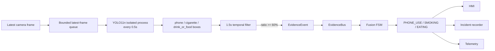

# دليل دمج YOLO11n للهاتف والأكل والتدخين

## النتيجة الحالية

تم دمج وزن YOLO11n مدرب مسبقًا من مشروع:

```text
https://github.com/luthfajr/driver-inattention-detection
commit: 7cb52d367a936e8803d61b960d830291fa8f880e
```

الوزن المحلي:

```text
models/driver_behavior/luthfi_yolo11n/best_yolo11n.pt
```

الفئات السبعة في المصدر:

```text
cigarette
closed_eyes
drink_or_food
hand_near_head
inattentive_gaze
open_mouth
phone
```

نستخدم منه حاليًا:

| فئة YOLO | مخالفة النظام |
|---|---|
| `phone` | `PHONE_USE` |
| `cigarette` | `SMOKING` |
| `drink_or_food` | `EATING` |

لا نستخدم `closed_eyes` بدل نظام العين الحالي؛ لأن مسار MediaPipe والمعايرة وStrong Bilateral Closure أدق زمنيًا ومتكامل مع Fusion.

## لماذا اخترنا هذا الوزن؟

- YOLO11n نسخة Nano خفيفة نسبيًا.
- يجمع الفئات الثلاث المطلوبة في وزن واحد.
- بياناته موجهة لصورة السائق الأمامية، وهي زاوية الكاميرا المقترحة للنظام.
- وزنه نحو 5.2MB.
- يمكن تصديره إلى NCNN لـRaspberry Pi 5.

القيود:

- لا ينشر المصدر Metrics نهائية واضحة لكل فئة.
- الكاميرا الجانبية خارج مجال تدريبه.
- لا يوجد `LICENSE` صريح للمستودع عند commit الذي أخذنا منه الوزن.
- Ultralytics YOLO يخضع لـAGPL-3.0 أو Enterprise حسب الاستخدام.
- لذلك الحالة القانونية والتقنية هي `RESEARCH_CONTROLLED_DEMO` وليست Production.

## سلامة ملف الموديل

```text
size: 5462298 bytes
sha256: 37ab5aeee2c4f655fcbe733195e53cff8c4ea03ab36accd064d1bee4b22c0c9d
```

الـManifest موجود في:

```text
models/driver_behavior/luthfi_yolo11n/model_manifest.json
```

تحقق بدون PyTorch:

```bash
source .venv-dms/bin/activate
PYTHONPATH=. python -m dms_final_system.runtime.objects.verify_model \
  --bundle dms_final_system/models/driver_behavior/luthfi_yolo11n
```

تحقق عميق بعد تثبيت Ultralytics:

```bash
PYTHONPATH=. python -m dms_final_system.runtime.objects.verify_model \
  --bundle dms_final_system/models/driver_behavior/luthfi_yolo11n \
  --deep
```

ملاحظة أمنية: ملف `.pt` هو PyTorch checkpoint ويجب تحميله فقط من مصدر موثوق. تحقق SHA-256 قبل التحميل.

## تثبيت المتطلبات

على اللابتوب:

```bash
cd /path/to/project2
python3 -m venv .venv-dms
source .venv-dms/bin/activate
python -m pip install --upgrade pip
pip install -r dms_final_system/requirements-laptop.txt
```

تنزيل PyTorch قد يكون كبيرًا ويستغرق وقتًا حسب سرعة الشبكة.

## كيف يعمل الدمج؟



YOLO يعمل داخل process مستقل بنمط `spawn`، بينما Thread خفيف في العملية الأساسية يستقبل النتيجة وينشرها إلى Evidence Bus. هذا العزل يمنع تعارض مكتبات MediaPipe/EGL مع PyTorch/Ultralytics من إسقاط نظام DMS كاملًا بسبب native crash. Queue حجمها 1 وتحذف الفريم القديم عند التأخر، لذلك لا يتراكم Delay ولا ينتظر MediaPipe انتهاء YOLO. الإعداد التشغيلي هو `behavior_detector.execution_mode="process"`؛ يبقى نمط `thread` للتشخيص فقط وليس الإعداد الموصى به.

الإعداد الافتراضي:

```text
YOLO inference interval = 0.5s
temporal window = 1.5s
minimum samples = 3
activation ratio = 60%
activation persistence = 0.5s
clear persistence = 2.0s
evidence refresh = 1.0s
evidence TTL = 2.5s
```

Detection واحد عابر لا يصدر مخالفة. يجب أن يتكرر السلوك خلال النافذة، وبعد التفعيل يُجدد Evidence حتى يختفي السلوك.

## حدود الثقة

```json
{
  "phone": 0.40,
  "cigarette": 0.30,
  "drink_or_food": 0.35
}
```

حد السيجارة أقل لأنها جسم صغير، لكن التثبيت الزمني يمنع الاعتماد على فريم واحد. هذه حدود Pilot ويجب إعادة ضبطها من فيديو موسوم بالكاميرا الحقيقية.

## علاقته مع النعاس والـFusion

هذه الفئات **مخالفات مستقلة**، وليست دليل نعاس:

```text
driver_state = NORMAL
violations = [PHONE_USE]
alarm_level = WARNING
```

- الهاتف لا يجعل السائق `DROWSY`.
- الأكل لا يجعل السائق `FATIGUE_WARNING`.
- التدخين لا يجعل السائق `CRITICAL`.
- `CRITICAL` للنعاس يبقى مصدره Strong Bilateral Eye Closure فقط.
- المخالفة تفتح/تمدد Incident وتسجل الفيديو والـTelemetry.
- السياسة الحالية لا تشغل صوت Drowsy للهاتف/الأكل/التدخين؛ تعرضها بصريًا وتسجلها. يمكن إضافة أنماط صوت مستقلة لاحقًا دون تعديل YOLO أو Fusion.

## HMI والـLogging

النافذة تعرض:

- حالة Detector: `READY/FAILED/DISABLED`.
- Active violations.
- Bounding boxes الحديثة فقط، حتى `0.75s` من وقت الكشف.
- Boxes ترسم على نسخة HMI؛ الفيديو الخام لا يتغير.

Telemetry stages:

```text
BehaviorDetector/startup_ready
BehaviorDetector/startup_failed
BehaviorDetector/inference
BehaviorDetector/evidence_published
BehaviorDetector/inference_failed
```

كل inference يسجل detections، confidence، ratios، active behaviors، latency وdropped frames.

## تشغيل النظام الكامل على اللابتوب

الإعداد `runtime.laptop_alarm_demo.json` يشغل:

- Drowsiness LightGBM + Events + Fusion.
- YOLO phone/eating/smoking.
- HMI.
- Local drowsiness audio.
- Full evaluation recording وIncident recording.

```bash
source .venv-dms/bin/activate
PYTHONPATH=. python -m dms_final_system.runtime.app \
  --config dms_final_system/configs/runtime.laptop_alarm_demo.json
```

إذا لم تثبت Ultralytics سيوقف Startup برسالة واضحة لأن `behavior_detector.required=true`.

## Replay صامت

```bash
PYTHONPATH=. python -m dms_final_system.runtime.app \
  --config dms_final_system/configs/runtime.replay_silent.json \
  --replay /path/to/video.mp4
```

Replay يشغل YOLO ويسجل Virtual alarm decisions لكنه لا يشغل السماعة.

## وسم الهاتف والأكل والتدخين

بعد تسجيل Evaluation Session:

```bash
PYTHONPATH=. python -m dms_final_system.runtime.evaluation.annotate \
  dms_final_system/evaluation_sessions/<session_id>
```

المفاتيح الجديدة:

```text
p = PHONE_USE
e = EATING
s = SMOKING
```

اضغط المفتاح عند بداية السلوك، واضغطه مرة أخرى عند النهاية. لا تشاهد احتمالات YOLO أثناء الوسم لتجنب الانحياز.

تقرير Evaluation يضيف Precision/Recall/F1 لهذه الأحداث، لكن لا يدخلها في بوابة قبول النعاس.

## تصدير NCNN للـRaspberry Pi 5

نفذ التصدير على اللابتوب أو Colab بعد تثبيت Ultralytics:

```bash
PYTHONPATH=. python -m dms_final_system.runtime.objects.export_ncnn \
  --model dms_final_system/models/driver_behavior/luthfi_yolo11n/best_yolo11n.pt \
  --imgsz 640
```

سينتج غالبًا:

```text
best_yolo11n_ncnn_model/
```

انقل الفولدر إلى Raspberry ثم غيّر:

```json
"model_path": "models/driver_behavior/luthfi_yolo11n/best_yolo11n_ncnn_model"
```

لا تغير `class_mapping`.

على Pi بدون AI accelerator ابدأ بـ:

```json
"inference_interval_sec": 0.75,
"image_size": 640,
"queue_size": 1
```

إذا انخفض MediaPipe أو Capture عن المستوى المقبول:

1. ارفع interval إلى `1.0s`.
2. استخدم Driver ROI لتقليل مساحة الصورة غير المهمة.
3. جرّب `image_size=480` ثم قس Recall للسيجارة خصوصًا.
4. لا تخفض الدقة إلى 320 قبل اختبار السيجارة؛ قد تختفي كجسم صغير.

## Driver ROI

`driver_roi` إحداثيات مطبعة من الصورة الكاملة:

```json
"driver_roi": [x1, y1, x2, y2]
```

مثال قص 70% من الجهة اليسرى:

```json
"driver_roi": [0.0, 0.0, 0.70, 1.0]
```

يجب أن يحتوي القص وجه السائق ويديه والمنطقة حول الفم. ROI خاطئ يمكن أن يحسن FPS لكنه يدمر Recall.

## سيناريو اختبار خمس دقائق

1. دقيقة دون أي عنصر: يجب ألا تظهر مخالفة.
2. ضع هاتفًا على الحامل دون لمسه: سجل هل يظهر False Positive؛ الوزن الحالي يكشف `phone` وقد لا يميز الاستخدام من مجرد الوجود.
3. امسك الهاتف 10 ثوانٍ في أوضاع متعددة.
4. استخدم طعامًا/كوبًا قرب الفم 10 ثوانٍ.
5. استخدم جسمًا آمنًا يمثل سيجارة، دون إشعال شيء داخل المركبة.
6. قرّب قلمًا أو إصبعًا من الفم كـhard negative.
7. جرّب اليد على الوجه دون هاتف.

راجع:

- عدد الأحداث الصحيحة والمفقودة.
- False alerts per behavior-free minute/hour.
- Detection onset delay.
- Inference p50/p95.
- Capture FPS وMediaPipe FPS.
- `dropped_frames` في BehaviorDetector.

## حدود هذا الإصدار والخطوة العلمية التالية

الوزن قد يكتشف هاتفًا ظاهرًا حتى لو لم يستخدمه السائق؛ وفئة `drink_or_food` تجمع الأكل والشرب. لذلك هذه النسخة لإثبات التكامل وجمع البيانات.

للوصول إلى نسخة قوية:

1. سجل كاميرا المقصورة الفعلية.
2. وسم Phone-use/Eating/Smoking على فترات، مع سلبيات صعبة.
3. افصل السائقين والمركبات بين Train وAcceptance.
4. أضف ROI أو علاقة العنصر باليد/الفم.
5. Fine-tune YOLO11n على بيانات الشركة.
6. قس AP/Recall لكل فئة وFalse alerts/hour قبل وبعد NCNN/INT8.
