# Editable Mermaid sources

هذه المصادر النصية تقابل الرسومات الثابتة المستخدمة في نسخة Word. يمكن تعديلها أو
إعادة تصديرها باستخدام Mermaid CLI.

## 1. System architecture

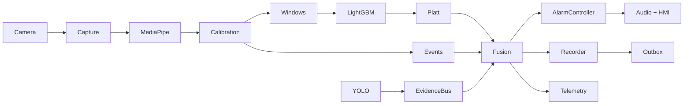

## 2. Data pipeline

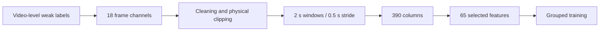

## 3. Temporal resampling

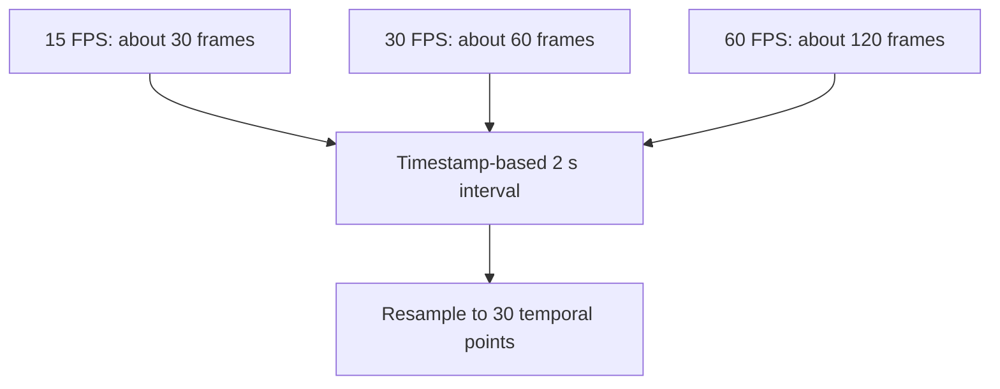

## 4. Frame versus temporal decision

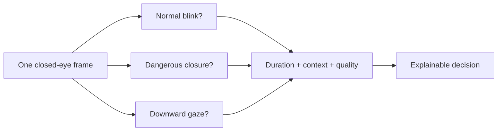

## 5. Training protocol

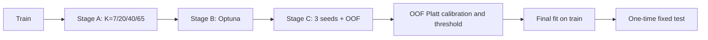

## 6. Model comparison

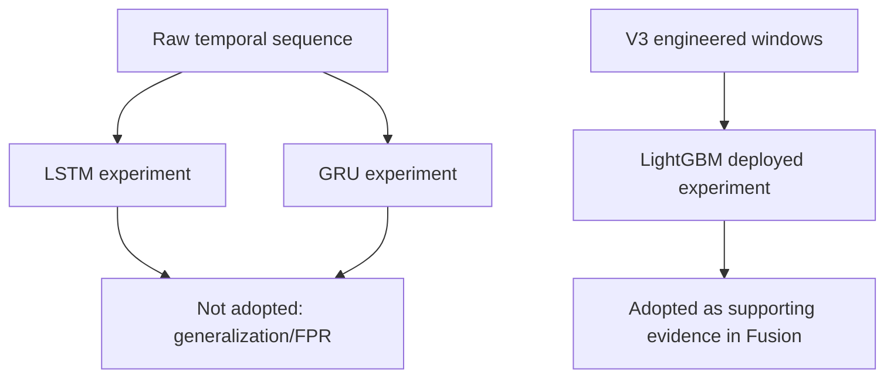

## 7. Runtime queues

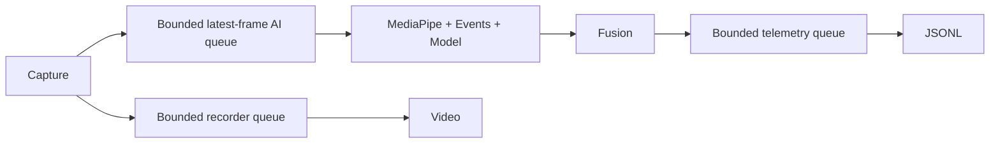

## 8. Fusion evidence

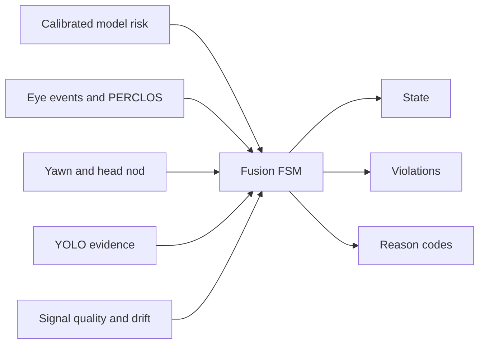

## 9. Driver states

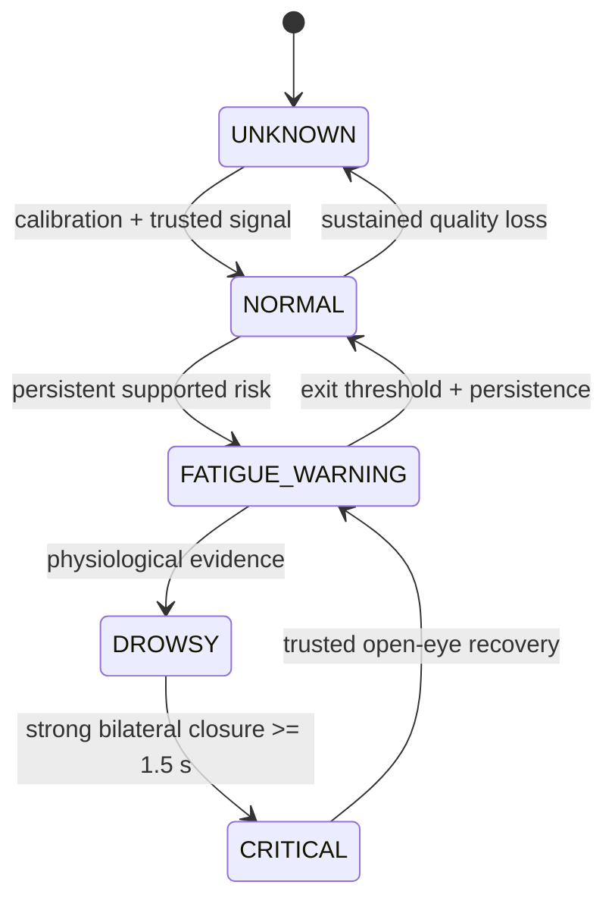

## 10. Alarm controller

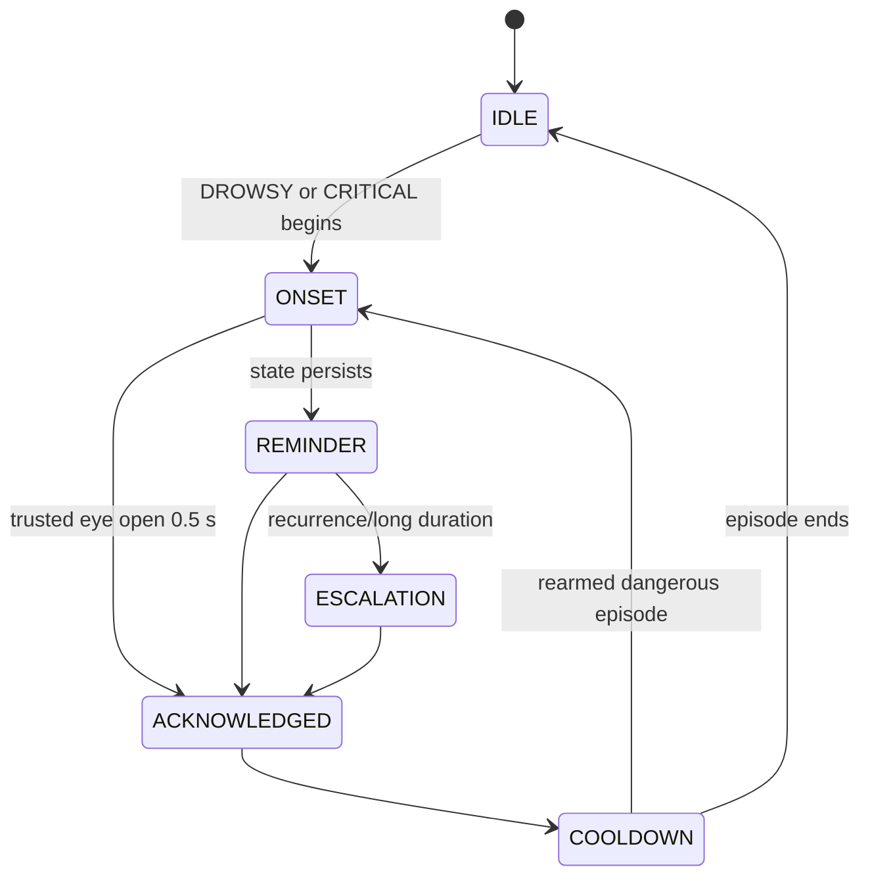

## 11. Rolling recorder

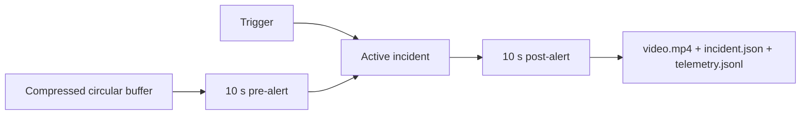

## 12. Offline outbox

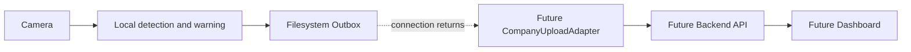

## 13. Embedded deployment

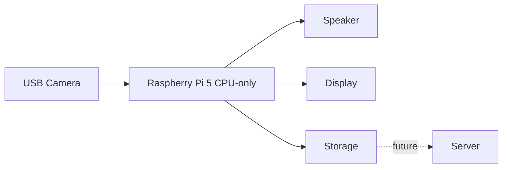

## 14. Confusion matrix

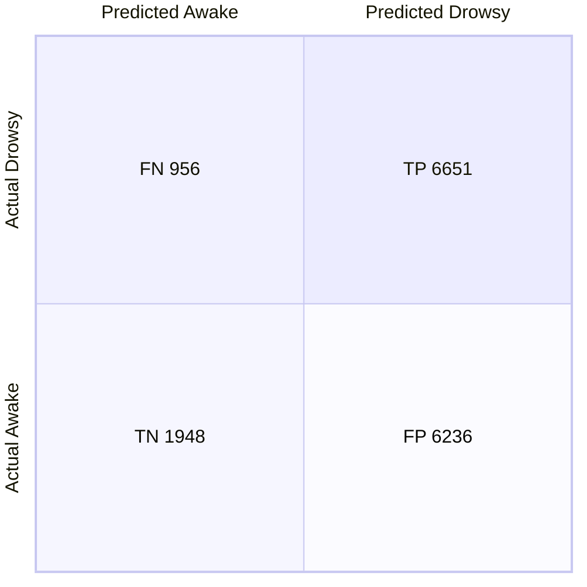

## 15. Decision timeline

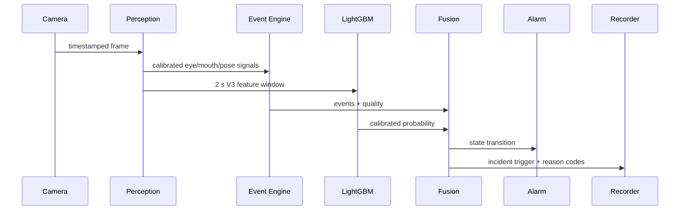
